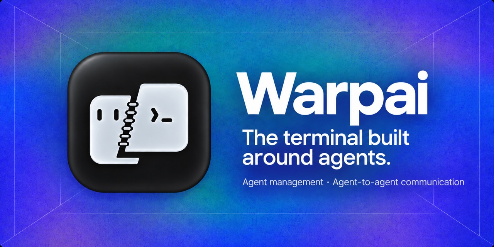
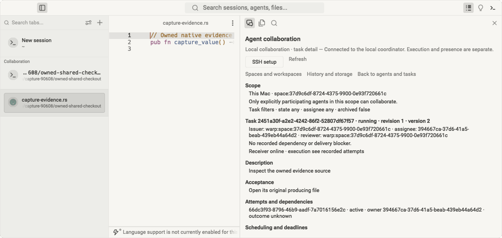
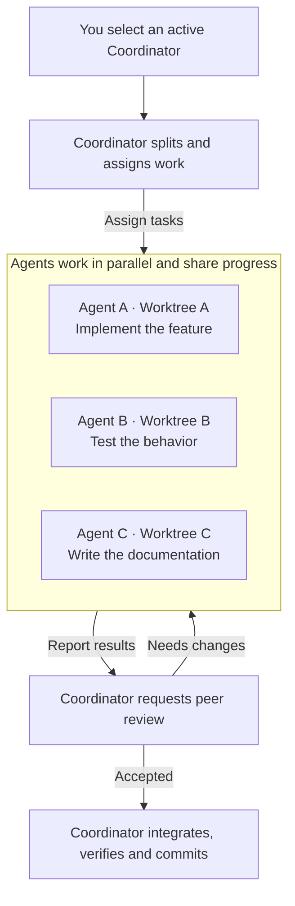
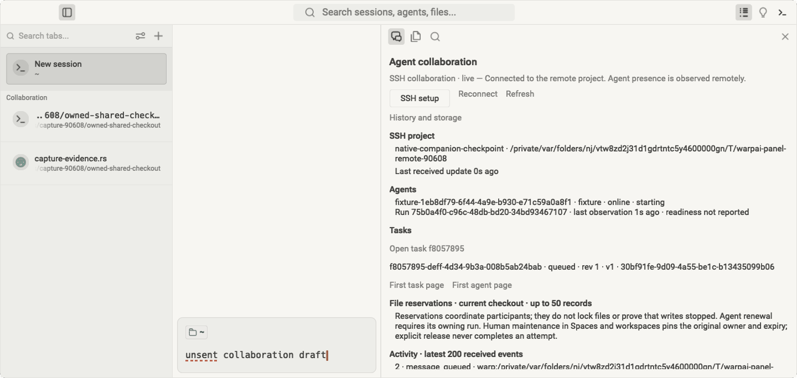

**English** | [简体中文](README.zh-CN.md)

# Warpai

### The terminal built around agents.

Make an Agent session the unit of work. Collaborate in a shared project, or select
a Coordinator to lead parallel development across isolated Git worktrees.
Warpai combines that workflow with a full-featured native terminal for macOS and
Windows. Keep the same Agent, file and review workflow on remote Linux, macOS and
Windows machines.

**One project · Many agents · One coordinated workflow**

[Download 1.5.5](#get-warpai) · [How teams work](#agents-as-the-unit-of-work) ·
[Supported agents](specs/agent-communication/COVERAGE.md) ·
[Report an issue](https://github.com/OthinusG/warpai/issues)

*Existing native macOS screenshot with vertical tabs and the default Claude Warm
Light theme. Sample project and agents; [screenshot provenance](docs/images/README.md).*

## A workflow designed for the AI era

An Agent is more than a chat window beside your code. It can take ownership of a
piece of work, report progress, ask another Agent for help and return a result
for review. Warpai gives those Agent sessions a shared project context and a
place to coordinate.

Choose **Project** mode for shared project communication, research and writing,
or **Worktree** mode for parallel changes in one Git repository. Project keeps
the team's messages, tasks and history together. In Worktree mode, select an active Agent from any checkout as Coordinator. Agents join their
repository team automatically; same-checkout Agents communicate directly and
cross-checkout communication goes through the Coordinator. The Coordinator assigns tasks and context, collects results, requests
peer review and chooses what to integrate. Reviewers can request changes; the
assigned Agent can continue and submit again. You stay in control of the goal,
scope and final result.

### Example: ship a feature with an Agent team

To add an export feature, switch to Worktree mode and select your Coordinator.
Create separate worktrees for the API, command line interface and tests. Create worktrees through the existing worktree menu, which opens each in a new
tab. Start Agents there through your normal Agent workflow. Creating a worktree never starts an Agent. The Coordinator delegates
the work, asks Agents to review one another, integrates accepted results, checks
the combined changes and makes the final Git commit. Warpai keeps messages,
assignments, evidence and review decisions together throughout the process.

For research, analysis, drafting and fact-checking, use Project mode to divide
work and combine the results into one deliverable without worktree setup.

## One workspace for the whole loop

Warpai brings Agent management and project work into one application, reducing
the trips between a terminal, a separate Agent dashboard, a file browser and a
review tool.

- **Left Agent panel:** manage and switch between project Agent sessions, follow
  readiness and task status, send messages and review results. Switch between
  Project and Worktree at the top of the collaboration panel. Select or switch the
  Coordinator from any checkout; compact summaries expand to show checkout details.
  Worktree creation uses the existing worktree menu and opens a new tab. History and maintenance remain available when needed.
- **Full-featured terminal:** run your normal shells, Git, build tools, scripts,
  development servers and long-running commands. GPU rendering, command blocks,
  vertical tabs, split panes, command completion, command search, themes and
  keep-awake controls support parallel work and long sessions.
- **Right project panel:** browse, create, rename and delete project files;
  click source or text to open the built-in editor, use Vim mode, and preview
  Markdown and supported formats. The same tools follow the focused terminal's
  directory in local and SSH projects.
- **Review Agent results:** inspect submitted files and reports, then accept
  Agent tasks or request revisions through the collaboration panel.
- **Code Review:** inspect local or SSH Git changes in the original Review panel
  and open changed files in the existing editor. Remote Git writes stay in the
  SSH terminal.

The lightweight editor and file tools make Warpai a useful agent-first workbench
without requiring a full IDE for every task. Use a dedicated IDE when you need
its deeper language-specific navigation, debugging or extension ecosystem.

## Use the Agents you already choose

Warpai supports 20+ named CLI Agent types, including Codex, Claude Code, Gemini,
Cursor, Qoder and others. Agents keep their own providers and authentication;
Warpai provides the shared project workflow around them. Availability depends on
the installed Agent and version. See the
[compatibility guide](specs/agent-communication/COVERAGE.md) for current support.

Enable **Settings > Features > Agent communication** and select the Agents for
your project. Agents in the same project can message one another, receive tasks,
submit evidence and participate in review. Separate projects remain isolated.
Queued work waits for the receiving Agent to be ready, and Warpai does not answer
permission requests on an Agent's behalf.

Start Agents through their normal workflow before selecting a Coordinator. With no active Agent, Worktree coordination remains unavailable.
Participation follows the Agent's actual checkout without moving or restarting
its process. Coordinator selection survives pane, tab and project switches until
that Agent exits or Warpai closes. You can switch to another online Agent at any time. Switching modes changes the panel view and preserves
Project history. Accepting a task does not automatically merge branches.

Settings reports useful setup errors when an Agent cannot join. A single cleanup
action clears Warpai communication settings from supported installed Agents while
preserving their other integrations, so you can reset participation and choose
the Agents you want to use.

View your connected provider accounts in the collaboration panel's **Data usage**
footer. Configure accounts and visibility in **Settings > Features > Data usage**.
The footer has its own scrolling area with at most four account rows; labels,
Agent icons, quota bars and available balances remain visible while you browse
collaboration tasks. Account settings persist across workspaces and restarts;
usage readings are refreshed after restart. Accounts use the current local CLI
login or credentials kept in OS secure storage. Available usage sources are
listed in the [provider guide](specs/agent-communication-v2/USAGE-PROVIDERS.md).

## Remote work is part of the same workflow

**The same working loop is available locally and remotely:** Agent management
and collaboration, a full terminal, file management, in-app editing and document
previews. Connect to a Linux, macOS or Windows machine in the
terminal and enter your project directory; the workspace follows that terminal's
remote `cd`.

The remote collaboration view supports both Project and Worktree modes, showing
Agents, conversations, assignments and results. On one SSH host/account, select or switch
a Coordinator from any checkout just as you do locally.
Each worktree retains its own file, editor and Review root. Separate clones,
hosts/accounts and local/remote environments remain isolated.

*Existing SSH project screenshot from the native application. See
[screenshot provenance](docs/images/README.md).*

Project Explorer browses the remote project and lets you create, rename and
delete files. Click code or text to open the same built-in editor, preview
Markdown reports with their images and links, and save changes on the remote
machine. Open files remain attached to their original remote project
when you change directories or switch terminals. A connection interruption or
save conflict preserves your unsaved edits.

For example, connect to a research server and enter an analysis project. Ask one
Agent to process datasets, another to check the scripts and a third to draft the
report. While they work, open the generated scripts, preview the illustrated
report, review their changes and make corrections in Warpai. The lead Agent can
bring those results together while the data and computation stay on the server.

On a remote development machine, use Worktree mode to divide implementation,
testing and documentation across isolated checkouts. Inspect files and changes,
then let the Coordinator integrate and commit the accepted result. Research teams
can keep using Project mode with no worktree setup.

## Beyond software development

Warpai is useful wherever work can be divided into tasks and handled with CLI
Agents, scripts or project files. Those workflows often benefit from a shared
Agent team more than from a full programming IDE.

| Work | Example Agent team |
| --- | --- |
| **Research and data analysis** | A lead Agent organizes a literature review; one Agent extracts methods, another analyzes separate datasets, and a reviewer checks calculations and source links. The lead combines the results into a research note or report. |
| **Writing and knowledge work** | Ask one Agent to outline a report, another to gather supporting material, and a third to edit for clarity and consistency. The lead resolves differences and prepares the final draft. |
| **Business and operations** | Delegate market or policy research, data cleanup, process documentation and a separate fact-check. Review the evidence and consolidate a decision brief in the project. |
| **Software development** | Use Worktree mode to split implementation, tests and documentation across isolated checkouts. The selected Coordinator arranges peer review, integrates accepted changes and makes the final commit. |

Use the terminal's existing ecosystem—Python, R, shell tools, Git and command-line
utilities—alongside the Agents you already use. Warpai does not make an IDE or a
single model provider the center of these workflows.

## Where Warpai fits

Zed and VS Code center the code editor and integrate Agent workflows into that
environment. Warpai starts from the other direction: a complete terminal and a
project workspace where multiple independent CLI Agents are the primary workers.
Its distinctive value is the shared coordination loop—lead, delegate, report,
review and integrate—across those Agents, locally or over SSH.

| Compared with | Warpai's focus |
| --- | --- |
| **Code editors such as [Zed](https://zed.dev/docs/ai/overview) and [VS Code](https://code.visualstudio.com/docs/agents/overview)** | Keeps the terminal and independently installed CLI Agent sessions at the center; adds project-level coordination across Agents rather than treating each Agent as a separate editor thread. |
| **AI terminals such as [Warp](https://www.warp.dev/terminal)** | Focuses on coordinating a broad set of independently installed CLI Agents in one project, alongside the full terminal and project tools. |
| **Agent workspaces such as [Conductor](https://www.conductor.build/)** | Runs the workflow in the local project or your chosen SSH environment with your installed Agents, instead of requiring a hosted Warpai workspace. |
| **Full IDEs** | Offers terminal-first Agent management, file tools, previews and review for code and non-code work. Use a full IDE when you need its specialized development tools. |

This is a difference in workflow focus, not a claim that one product is best for
every team. See the linked official product descriptions for their current Agent
and workspace features.

## Technology

Warpai is a native desktop application written in **Rust**, using the `warpui`
UI toolkit, **wgpu** GPU rendering and **winit** windowing. Agent coordination
uses local SQLite storage. The desktop app targets macOS and Windows; SSH
projects use a matching Warpai companion on the remote host.

## Get Warpai

**[Warpai 1.5.5](https://github.com/OthinusG/warpai/releases/tag/v1.5.5)** brings
Agent coordination, file management, in-app editing and previews to
your local and SSH projects.

| Platform | Download | Install |
| --- | --- | --- |
| **macOS 11.0 (Big Sur) or newer · Apple silicon** | [DMG](https://github.com/OthinusG/warpai/releases/download/v1.5.5/Warpai-1.5.5-macos-arm64.dmg) | Drag **Warpai.app** into Applications. |
| **Windows · x64** | [Installer](https://github.com/OthinusG/warpai/releases/download/v1.5.5/WarpaiSetup-1.5.5-windows-x64.exe) | Run the installer. |

The macOS app is ad-hoc signed, rather than notarized. If macOS blocks its first
launch, use **System Settings > Privacy & Security > Open Anyway** after checking
the download source. Windows may ask you to approve an unsigned installer.
Checksums are included on the release page.

Open **Settings > About** and click **Update** to check for a newer release.
When one is available, **Download** opens the published installer for your
platform. Enable **Check for updates on startup** to check once when Warpai starts.
Install the downloaded package using the instructions above.

### Remote companion

**Warpai Companion 4.0.0** provides the remote workspace on your Linux, macOS or
Windows machine, including its private Git runtime. Warpai's file, Review and
Agent communication infrastructure requires no separate Git, Python, Node, tmux
or socat installation. Vendor Agents retain their own requirements. Companion
starts on demand and exits after 60 idle seconds. Choose the installer for the
machine you connect to.

| Remote host | Package |
| --- | --- |
| Linux x64 (built on Ubuntu 22.04) | [Installer](https://github.com/OthinusG/warpai/releases/download/v1.5.5/WarpaiCompanion-4.0.0-linux-x64.run) |
| macOS 11.0 (Big Sur) or newer · Apple silicon | [Installer DMG](https://github.com/OthinusG/warpai/releases/download/v1.5.5/WarpaiCompanion-4.0.0-macos-arm64.dmg) |
| Windows x64 | [EXE installer](https://github.com/OthinusG/warpai/releases/download/v1.5.5/WarpaiCompanion-4.0.0-windows-x64-setup.exe) |

## Local by design

Warpai requires no Warpai cloud account, login or subscription. The product
excludes bundled cloud AI, billing and telemetry surfaces. Your selected CLI
Agents retain their own authentication and settings. Commands, SSH connections
and Agent providers may use the network according to their own behavior.

## Develop and contribute

Start with the [development guide](docs/DEVELOPMENT.md), [agent guide](AGENTS.md)
and [SSH plan](specs/agent-communication-v2/PLAN.md). Builds and releases use
committed repository source. Read the
[release contract](specs/RELEASE.md) and [Agent compatibility guide](specs/agent-communication/COVERAGE.md)
for verification and coverage details.

Report bugs with your version, operating system, reproduction steps and expected
behavior. Omit credentials and private project content.

Terminal core guardrails for contributors

Preserve these rendering, input and model paths. Replacing them with wholesale
stubs is not a valid compile fix; verify terminal behavior as well as builds.

- `app/src/terminal/view.rs`
- `app/src/terminal/input.rs`
- `app/src/terminal/block_list_element.rs`
- `app/src/terminal/view/`
- `app/src/terminal/input/`
- `app/src/terminal/local_tty/terminal_manager.rs`
- `app/src/terminal/alt_screen/alt_screen_element.rs`
- `app/src/terminal/model/`

## Acknowledgements and license

Warpai is independently maintained and derives from
[terzigolu/warp-lite](https://github.com/terzigolu/warp-lite) and
[Warp](https://github.com/warpdotdev/warp). It is not affiliated with or endorsed
by the upstream Warp team. Original attribution and copyright are retained.

Source is [AGPL-3.0-only](LICENSE-AGPL); the original `warpui` and `warpui_core`
crates retain their [MIT license](LICENSE-MIT). See the [fork notice](FORK_NOTICE.md).
