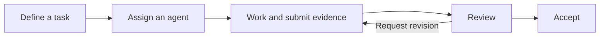

<div align="center">

**English** | [简体中文](README.zh-CN.md)

# Warpai


### A terminal workspace for your code and your agents.

A native, local-first terminal for macOS and Windows. Run commands, explore
projects and coordinate independently installed CLI agents in one workspace.

**Command blocks · GPU rendering · Vertical tabs · Agent collaboration · SSH projects**

[Download 1.0.1](#get-warpai) · [Get started](#start-working) ·
[Agent compatibility](specs/agent-communication/COVERAGE.md) ·
[Report an issue](https://github.com/OthinusG/warpai/issues)

[](https://github.com/OthinusG/warpai/releases/tag/v1.0.1)
[](LICENSE-AGPL)
[](#get-warpai)

</div>

Warpai keeps development close to your project: a shell for execution, an editor
for context and a collaboration panel for agent work. Use Git, package managers,
build tools and CLI agents you already install and maintain. Open the app and
start working without a Warpai account or subscription.


*Native macOS, vertical tabs and the default Claude Warm Light theme. Sample
projects and agents; [screenshot provenance](docs/images/README.md).*

## Why use Warpai?

| Advantage | In everyday use |
| --- | --- |
| **Readable command history** | Each command stays with its output in a block, making builds, errors and previous results easier to revisit. |
| **One project workspace** | Keep terminals, files, Markdown and agent tasks nearby. Vertical tabs and split panes give parallel work its own space. |
| **Your agents and providers** | Use independently installed Codex, Claude Code, QoderCN and other CLI agents. Choose their provider, authentication and permission settings yourself. |
| **Structured collaboration** | Exchange messages, assign tasks, collect evidence and review results within the project. |
| **Local ownership** | Local coordination runs on your machine. SSH coordination runs in the selected remote account and project, without a Warpai hosted service. |

## Terminal and project tools

- **GPU-rendered terminal:** command blocks, tabs and split panes for interactive shells, development servers and long-running builds.
- **Project Explorer and editor:** browse files, inspect source, use Vim mode and read Markdown without losing terminal context.
- **Command palette and completion:** find actions and keep routine shell work moving.
- **Appearance:** choose light or dark themes, fonts and tab layout. Claude Warm Light is the default.
- **Keep awake:** a session-scoped toggle prevents idle system sleep while a tracked agent works. The display can sleep; the toggle resets on app restart.

## Agent collaboration

Run one agent on implementation and another on review. The collaboration panel
keeps messages, task state, submitted evidence and review decisions together.
A submitted result becomes accepted only after review.



Participating agents share a canonical project boundary. Unrelated projects stay
isolated. Queued work preserves input drafts and respects native readiness;
Warpai does not answer an agent's permission requests on your behalf.

Collaboration requires native MCP client support in the installed agent version.
See the [compatibility guide](specs/agent-communication/COVERAGE.md) for supported
commands, configuration ownership and verified coverage.

### Start working

1. [Install Warpai](#get-warpai).
2. Install and authenticate your preferred CLI agents using their own tools.
3. Open a project, then **Settings > Features > Agent communication**. Enable communication and select the agents allowed to participate.
4. Start new agent sessions in that project. Existing sessions may need a restart to load MCP configuration.
5. Open **Agent collaboration** to exchange messages, assign tasks and review results.

### Codex: use your usual command

In an enabled local Warpai terminal, launch Codex normally:

```sh
codex
codex --yolo
codex resume --last
```

Warpai adds session-only MCP options and `--no-daemon` to eligible interactive
launches. Each terminal gets an isolated native backend. Your original arguments,
project directory, provider and permission choices remain in effect.

The installed Codex must expose `-c` and `--no-daemon`. Warpai resolves and probes
the current installation for each launch, so updates through your package manager
continue to work. It does not replace the command, copy a temporary executable,
change PATH or CODEX_HOME, or read/write Codex configuration. Unsupported versions
launch normally with a visible MCP warning.

Help, login, MCP administration, batch commands, explicit remote connections,
user aliases and WSL retain native behavior. Managed SSH projects use the explicit
companion entry below. Commands outside Warpai are unaffected.

## Work on remote projects

Use the collaboration panel for an SSH project on **Linux, macOS or Windows**.
Agents share coordination within that remote account and project; your desktop
shows the remote location, messages, tasks and connection state.


*Native macOS, vertical tabs and Claude Warm Light, with a controlled sample SSH
project. Screenshots show genuine application UI.*

1. Configure a trusted host alias and working noninteractive authentication in your system OpenSSH client.
2. Download the matching [1.0.1 companion](#remote-companion), extract it on the remote account and make the Unix binary executable. Install and authenticate CLI agents on that account.
3. Open **Agent collaboration > Connect SSH project**. Enter the SSH alias, absolute project root and absolute companion path.
4. In an ordinary SSH terminal, launch a managed agent with that companion and the same project root:

```sh
/opt/warpai/warpai-companion agent /srv/project codex /usr/local/bin/codex
```

Replace those paths with your installed paths. Windows hosts use
`warpai-companion.exe` and their native absolute paths. Closing the SSH terminal
stops its owned agent run. After a disconnect, drafts remain available, remote
state is marked stale and writes stay disabled until you reconnect. Desktop
credentials are not copied to the remote account. File transfer uses SFTP.

Each SSH project has its own authority. Setup and behavior are described in the
[SSH technical guide](specs/agent-communication-v2/TECH.md).

## Get Warpai

**[Warpai 1.0.1](https://github.com/OthinusG/warpai/releases/tag/v1.0.1)** is the
first release under the Warpai name, including local agent collaboration,
session-scoped Codex MCP, SSH projects and the new application icon.

| Platform | Downloads | Install |
| --- | --- | --- |
| **macOS · Apple silicon** | [DMG](https://github.com/OthinusG/warpai/releases/download/v1.0.1/Warpai.dmg) · [App ZIP](https://github.com/OthinusG/warpai/releases/download/v1.0.1/Warpai.app.zip) | Drag **Warpai.app** into Applications. |
| **Windows · x64** | [Installer](https://github.com/OthinusG/warpai/releases/download/v1.0.1/WarpaiSetup-x64.exe) · [Portable ZIP](https://github.com/OthinusG/warpai/releases/download/v1.0.1/Warpai-windows-x64.zip) | Run the installer, or extract the ZIP and launch **Warpai.exe**. |

The macOS app is ad-hoc signed, rather than notarized. If macOS blocks its first
launch, use **System Settings > Privacy & Security > Open Anyway** after checking
the download source. Windows may ask you to approve an unsigned installer.
Checksums are included on the release page.

For updates, download the new release and replace the app or run its installer.
Your settings remain in the application data directory. Independently installed
CLI agents continue to update through their own package managers.

### Remote companion

Use companion packages from the same release as your desktop app. Their manifests
record the exact source revision, Rust target and SHA-256 checksum.

| Remote host | Package |
| --- | --- |
| Linux x64 (built on Ubuntu 22.04) | [Companion ZIP](https://github.com/OthinusG/warpai/releases/download/v1.0.1/Warpai-companion-x86_64-unknown-linux-gnu.zip) |
| macOS Apple silicon | [Companion ZIP](https://github.com/OthinusG/warpai/releases/download/v1.0.1/Warpai-companion-aarch64-apple-darwin.zip) |
| Windows x64 | [Companion ZIP](https://github.com/OthinusG/warpai/releases/download/v1.0.1/Warpai-companion-x86_64-pc-windows-msvc.zip) |

## Settings and local control

Settings, themes, managed MCP configuration and local application data use:

| System | Location |
| --- | --- |
| macOS | `~/.config/.warpai` |
| Windows | `%USERPROFILE%\.config\.warpai` |

On first launch, Warpai imports missing legacy settings without overwriting new
files; old directories remain available for recovery. Third-party agents keep
their own authentication and settings locations.

Warpai requires no cloud account, login gate or subscription and excludes bundled
cloud AI, billing and telemetry product surfaces. Shell commands, SSH and your
chosen agent providers can use the network according to their own behavior.

## Develop and contribute

Warpai is written in Rust. Start with the [development guide](docs/DEVELOPMENT.md),
[agent guide](AGENTS.md) and [SSH plan](specs/agent-communication-v2/PLAN.md).
Builds and releases use committed repository source.

Verification covers macOS/Windows application checks, native UI actions and
screenshots, three-platform companion tests and controlled OpenSSH. Native macOS
Codex 0.160.0 also passed two simultaneous sessions and four completed model/MCP
turns. See the [acceptance record](specs/agent-communication-v2/QUALITY.md),
[release contract](specs/RELEASE.md) and [agent compatibility guide](specs/agent-communication/COVERAGE.md).

Report bugs with your version, operating system, reproduction steps and expected
behavior. Omit credentials and private project content.

<details>
<summary>Terminal core guardrails for contributors</summary>

Preserve these rendering, input and model paths. Replacing them with wholesale
stubs is not a valid compile fix; verify terminal behavior as well as builds.

- `app/src/terminal/view.rs`
- `app/src/terminal/input.rs`
- `app/src/terminal/block_list_element.rs`
- `app/src/terminal/view/`
- `app/src/terminal/input/`
- `app/src/terminal/local_tty/terminal_manager.rs`
- `app/src/terminal/alt_screen/alt_screen_element.rs`
- `app/src/terminal/model/`

</details>

## Acknowledgements and license

Warpai is independently maintained and derives from
[terzigolu/warp-lite](https://github.com/terzigolu/warp-lite) and
[Warp](https://github.com/warpdotdev/warp). It is not affiliated with or endorsed by
the upstream Warp team. Original attribution and copyright are retained.

Source is [AGPL-3.0-only](LICENSE-AGPL); the original `warpui` and `warpui_core`
crates retain their [MIT license](LICENSE-MIT). See the [fork notice](FORK_NOTICE.md).
