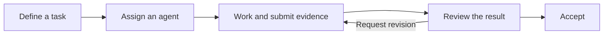

<div align="center">

**English** | [简体中文](README.zh-CN.md)

# Warpai

### Your terminal. Your projects. Your agents.

A local-first terminal for macOS and Windows, built for everyday development
and collaboration between your own CLI agents.

**Command blocks · GPU rendering · Project browsing · Agent collaboration · SSH projects**

[Get Warpai](#get-warpai) ·
[Agent compatibility](specs/agent-communication/COVERAGE.md) ·
[Get started](#start-working) ·
[Report an issue](https://github.com/OthinusG/warpai/issues)

[](LICENSE-AGPL)
[](#get-warpai)
[](#work-on-remote-projects)

</div>

Warpai brings commands, project files and agent conversations into one native
workspace. Run a build, inspect its output, browse the source and delegate a
focused task without moving your workflow into a hosted development platform.

Open straight into a terminal. Use the shell and CLI tools you already know.
Connect your own agents when you need them, with your choice of provider and
authentication.


*The native macOS workspace in the default Claude Warm Light theme with vertical
tabs enabled, showing a source file beside a task detail panel. Screenshots use
sample projects.*

## Why Warpai

| What matters | What Warpai gives you |
| --- | --- |
| **Readable terminal work** | Command blocks keep each command with its output. Tabs, split panes and GPU rendering support long-running builds and parallel work. |
| **Your tools, your choice** | Run independently installed CLI agents such as Codex, Claude Code and QoderCN. Choose and authenticate their providers yourself. |
| **A shared task workflow** | Participating agents can exchange messages, delegate tasks, submit evidence and review results in the same project. |
| **A workspace close to the code** | Browse project files, open source and Markdown, use Vim mode and switch between terminals in the native app. |
| **Local control** | No Warpai account or hosted coordination service is required. Local project coordination stays on your machine; SSH project coordination stays on the selected remote account. |
| **Confidence during interruptions** | Keep unsent drafts, see stale remote state, and review results before accepting work. Disconnected remote writes are disabled. |

## A terminal for everyday development

Use Warpai for the work you already do in a shell: Git, scripts, package managers,
builds, tests and remote commands. Command blocks make output easier to revisit;
tabs and split panes let you keep a server, test runner and working shell nearby.

The Project Explorer keeps files within reach. The editor, Vim mode, command
palette, completions and Markdown viewer help you move between a command and its
context. Choose a light or dark theme and adjust fonts to suit your workspace.

For long agent runs, the session-scoped **Keep awake** toggle prevents idle system
sleep while a tracked agent is working. The display can still sleep; the toggle
resets when the app restarts.

## Let your agents work together

Give one agent implementation work and another a review task. Keep the request,
execution state, submitted evidence and review decision in the same project
instead of carrying every handoff between terminal panes yourself.



- **Messages and tasks:** send a specific request, delegate work and follow its state.
- **Review before acceptance:** a submitted result remains separate from an accepted result.
- **Project boundaries:** participating agents in the same canonical project can communicate; unrelated projects remain isolated.
- **Protected interaction:** queued work preserves your drafts and does not answer agent permission requests. Delivery is not an acknowledgement or proof of completion.

Participation uses native MCP support. Availability depends on the installed CLI
and version; running an agent in the terminal and enabling agent collaboration
are separate capabilities. See the [agent compatibility guide](specs/agent-communication/COVERAGE.md)
for supported configuration paths and current verification.

### Start working

1. Install a build that includes agent collaboration from the table below.
2. Install and authenticate your preferred CLI agents using their own tools.
3. Open **Settings > Features > Agent communication** and select the agents that may participate.
4. Start new agent sessions in the same project. Restart existing sessions when their CLI requires it to load MCP configuration.
5. Open **Agent collaboration** to inspect agents, exchange messages and follow tasks.

You can disable communication or uncheck an agent to revoke its live access.
Warpai removes only the configuration it owns, preserving unrelated user settings.

## Work on remote projects

Use the same collaboration panel for agents running in a selected SSH project.
Agents on the same remote account and project share remote coordination, while
you inspect messages, tasks and connection status from your desktop.


*Native macOS vertical tabs and a connected SSH project in the default Claude
Warm Light theme, using a controlled sample agent.
The status view keeps the remote location and current task visible.*

1. Set up a trusted SSH host alias and working noninteractive authentication with your system OpenSSH client.
2. Place the matching **Warpai companion** on the remote account and install/authenticate the CLI agents there.
3. Open **Agent collaboration > Connect SSH project** and enter the SSH alias, absolute project root and installed companion path.
4. Launch each managed remote agent through the companion in an ordinary SSH terminal, using the same canonical project root.

```sh
/opt/warpai/warpai-companion agent /srv/project codex /usr/local/bin/codex
```

Replace the paths with those installed on your remote host. Closing that SSH
connection stops its owned agent run. Use **Reconnect** after a disconnect; unsent
forms remain available and writes stay disabled until connected. Desktop
credentials are not copied to the remote account.

Remote projects support **Linux, macOS and Windows**. Each selected project has
its own authority; this is not automatic coordination across different hosts or
between local and remote projects. See the [SSH setup and behavior](specs/agent-communication-v2/TECH.md)
and [acceptance record](specs/agent-communication-v2/QUALITY.md).

## Get Warpai

**Warpai is currently alpha software.** Choose a package based on the features you
want to try:

| Build | Includes | Downloads |
| --- | --- | --- |
| **Published release — `v0.5.7-lite`** | Terminal essentials. These packages retain the historical **WarpLite** name and do not include the current agent collaboration or SSH extension. | [macOS app ZIP and DMG; Windows x64 installer and portable ZIP](https://github.com/OthinusG/warpai/releases/tag/v0.5.7-lite) |
| **Validated Warpai review build** | Current local agent collaboration and SSH project panels. Desktop checks, native actions and screenshot review passed on macOS and Windows. | [Desktop packages](https://github.com/OthinusG/warpai/actions/runs/37152975773) · [Matching remote companions](https://github.com/OthinusG/warpai/actions/runs/37152973196) |

For the published release, drag **WarpLite.app** from the macOS DMG into
Applications. On Windows, run **WarpLiteSetup-x64.exe**, or extract the portable
ZIP and launch **WarpLite.exe**.

For collaboration, use the review run's **Warpai-agent-communication-macos** or
**Warpai-agent-communication-windows** artifact. Extract the downloaded artifact
first, then open the included app ZIP, installer or portable ZIP. GitHub Actions
artifact downloads may require a GitHub sign-in and expire; use a successful
[current validation run](https://github.com/OthinusG/warpai/actions/workflows/validate-agent-communication.yml)
if the linked artifacts are no longer available. Match the remote companion's
source manifest to the desktop build you choose.

The engineering gate includes real native processes and controlled OpenSSH
message/task/review tests. It does not certify every authenticated vendor/version
or physical remote host. [Detailed verification](specs/agent-communication-v2/QUALITY.md)
is available for evaluating the review build.

## Local-first by design

Warpai opens without a Warpai account, login gate or subscription. The default
product excludes bundled cloud AI, cloud account/billing flows and telemetry
product surfaces. Local commands and project coordination do not require a
Warpai cloud service.

Your commands, SSH sessions and independently installed agents can still use the
network. Agent providers retain their own accounts, pricing and data policies.
Unused inherited AI search implementations, bundled upstream AI skills and
unreferenced cloud release helpers have been removed. Shared code needed by the
terminal, editor, local CLI integration and stored-data compatibility remains;
see the [source cleanup record](specs/DEEP-CLEANUP.md).

Settings, themes, MCP configuration and local application data use
`~/.config/.warpai` on macOS and `%USERPROFILE%\.config\.warpai` on Windows.
On first launch, Warpai imports missing legacy settings without overwriting new
files; the old directories remain available for recovery. Third-party agent
configuration stays in each agent's own location.

## Develop and contribute

Warpai is written in Rust and maintained directly in this repository. Start with
the [development guide](docs/DEVELOPMENT.md), [agent guide](AGENTS.md) and
[current SSH plan](specs/agent-communication-v2/PLAN.md). Build and validation
workflows use committed repository source.

Bug reports are most useful with the build/source version, operating system,
steps to reproduce and expected behavior. Omit tokens, credentials and private
project content from reports.

<details>
<summary>Terminal core guardrails for contributors</summary>

Preserve these rendering, input and model paths. A compile fix that replaces them
with wholesale stubs is not a valid fix; verify terminal behavior as well as builds.

- `app/src/terminal/view.rs`
- `app/src/terminal/input.rs`
- `app/src/terminal/block_list_element.rs`
- `app/src/terminal/view/`
- `app/src/terminal/input/`
- `app/src/terminal/local_tty/terminal_manager.rs`
- `app/src/terminal/alt_screen/alt_screen_element.rs`
- `app/src/terminal/model/`

</details>

## Acknowledgements and license

Warpai is independently maintained and derives from
[terzigolu/warp-lite](https://github.com/terzigolu/warp-lite) and
[Warp](https://github.com/warpdotdev/warp). It is not affiliated with or endorsed by
the upstream Warp team. Original copyright and attribution are retained.

Source is licensed under [AGPL-3.0-only](LICENSE-AGPL). The original `warpui` and
`warpui_core` crates retain their [MIT license](LICENSE-MIT). See the
[fork notice](FORK_NOTICE.md) for provenance and trademark information.
