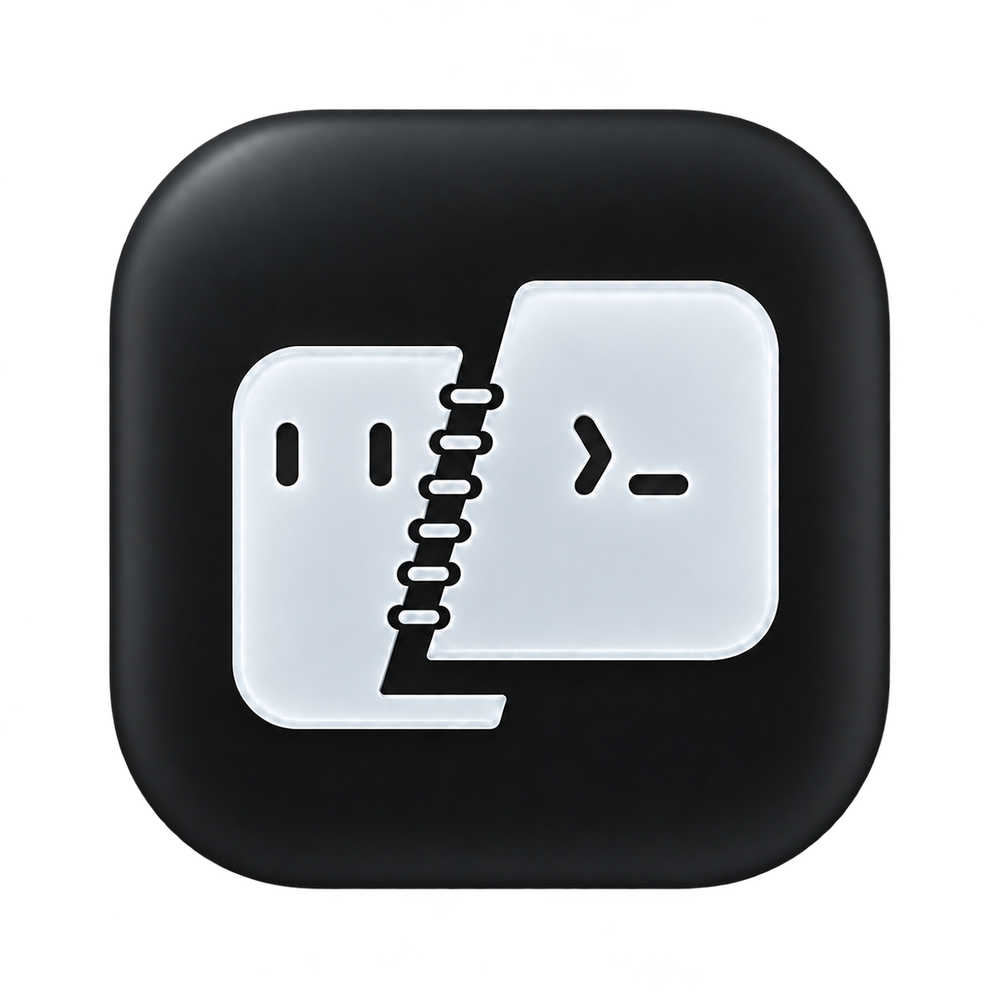
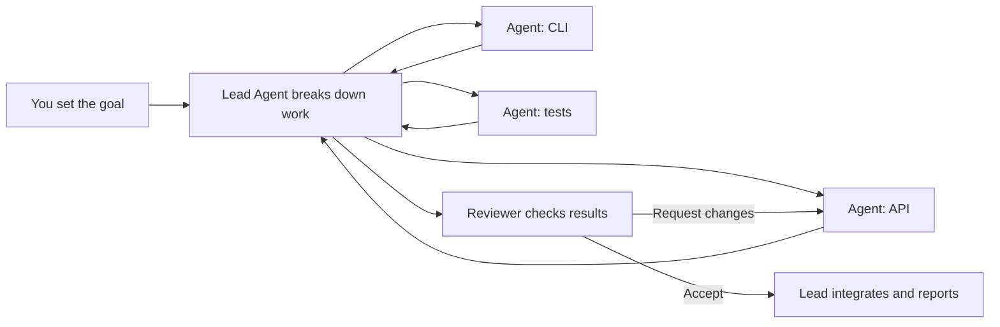

**English** | [简体中文](README.zh-CN.md)

# Warpai

### The terminal built around agents.

Make an Agent session the unit of work. Run a team in the same project, give one
Agent the lead, and let it delegate, collect results and bring the work together.
Warpai combines that workflow with a full-featured native terminal for macOS and
Windows.

**One project · Many agents · One coordinated workflow**

[Download 1.2.0](#get-warpai) · [How teams work](#agents-as-the-unit-of-work) ·
[Supported agents](specs/agent-communication/COVERAGE.md) ·
[Report an issue](https://github.com/OthinusG/warpai/issues)

*Existing native macOS screenshot with vertical tabs and the default Claude Warm
Light theme. Sample project and agents; [screenshot provenance](docs/images/README.md).*

## A workflow designed for the AI era

An Agent is more than a chat window beside your code. It can take ownership of a
piece of work, report progress, ask another Agent for help and return a result
for review. Warpai gives those Agent sessions a shared project context and a
place to coordinate.

You can keep several Agents working in parallel, each with a clear assignment.
One Agent can act as the lead: break down your request, give different Agents
their tasks, follow up on results and integrate their contributions. Reviewers
can request changes; the assigned Agent can continue and submit again. You stay
in control of the goal, scope and final result.

### Example: ship a feature with an Agent team

Ask a lead Agent to add an export feature. It can assign the API change, command
line interface and test plan to separate Agents, then ask a reviewer to check
the combined result. Each Agent works in its own terminal session in the same
project. Warpai keeps their messages, assignments, progress, evidence and review
decisions together, so you can see what is underway and what still needs work.

The same pattern works when the work is not code: assign research, analysis,
drafting and fact-checking to different Agents, then have the lead combine their
results into one deliverable.

## One workspace for the whole loop

Warpai brings Agent management and project work into one application, reducing
the trips between a terminal, a separate Agent dashboard, a file browser and a
review tool.

- **Left Agent panel:** manage and switch between project Agent sessions, follow
  readiness and task status, send messages, assign work and review results. The
  daily collaboration view keeps assignments, progress and results in focus,
  with history and maintenance available when you need them.
- **Full-featured terminal:** run your normal shells, Git, build tools, scripts,
  development servers and long-running commands. GPU rendering, command blocks,
  vertical tabs, split panes, command completion, command search, themes and
  keep-awake controls support parallel work and long sessions.
- **Right project panel:** browse, create, rename and delete project files;
  click source or text to open the built-in editor, use Vim mode, and preview
  Markdown and supported formats. The same tools follow the focused terminal's
  directory in local and SSH projects.
- **Review in context:** inspect code changes and review Agent submissions in
  Warpai. Keep the terminal, files, preview and review close while deciding what
  to accept or send back for revision. Git Review uses the same familiar
  interactions for local and remote changes.

The lightweight editor and file tools make Warpai a useful agent-first workbench
without requiring a full IDE for every task. Use a dedicated IDE when you need
its deeper language-specific navigation, debugging or extension ecosystem.

## Use the Agents you already choose

Warpai supports 20+ named CLI Agent types, including Codex, Claude Code, Gemini,
Cursor, Qoder and others. Agents keep their own providers and authentication;
Warpai provides the shared project workflow around them. Availability depends on
the installed Agent and version. See the
[compatibility guide](specs/agent-communication/COVERAGE.md) for current support.

Enable **Settings > Features > Agent communication** and select the Agents for
your project. Agents in the same project can message one another, receive tasks,
submit evidence and participate in review. Separate projects remain isolated.
Queued work waits for the receiving Agent to be ready, and Warpai does not answer
permission requests on an Agent's behalf.

Settings reports useful setup errors when an Agent cannot join. If you are
upgrading from Warp Lite or an older Warpai setup, the cleanup action removes
Warpai's communication entries from supported installed Agents while preserving
unrelated MCP servers. Enable the Agents you want to use again after cleanup.

## Remote work is part of the same workflow

Connect to an SSH project and coordinate Agents running in that remote account
and project. The collaboration panel shows the remote project's Agents, messages,
tasks and connection state. Agents in the same remote project can exchange
messages, receive assignments, submit results and review task outcomes. Remote
companions support Linux, macOS and Windows; file transfer uses SFTP.

*Existing SSH project screenshot from the native application. See
[screenshot provenance](docs/images/README.md).*

This makes the Agent team useful on a workstation, a development server or a
remote research machine without moving the project into a hosted Warpai service.
After connecting in the terminal, the same workspace follows your remote `cd`:
browse and manage remote files in Project Explorer, click code or text to edit
inside Warpai, preview Markdown with its remote images and links, and save back
to the original remote file. Keep Git Review beside the remote Agent team to
inspect changes and send feedback without switching applications. Open tabs stay
bound to their original remote project when you change terminals or directories.
If another process changes a file or the connection drops, your unsaved edits
stay available; a conflicting save asks you to resolve the change rather than
silently overwriting someone else's work.

For example, connect to a research server, enter an analysis project, and ask
Agents to process datasets and draft a report. Open the generated scripts and
Markdown report in the same app, inspect plots embedded in the report, make a
correction, and save it on the server. The data and execution stay remote while
you retain the same review and coordination workflow.

Install the Companion from the same 1.2.0 release on your remote host, including
when upgrading a host previously used with 1.1. Remote file tools work through
SSH and SFTP, including supported SSH jump-host routes. Git Review inspects
uncommitted changes and available branch comparisons; commits and other Git
mutations use the remote terminal.

## Beyond software development

Warpai is useful wherever work can be divided into tasks and handled with CLI
Agents, scripts or project files. Those workflows often benefit from a shared
Agent team more than from a full programming IDE.

| Work | Example Agent team |
| --- | --- |
| **Research and data analysis** | A lead Agent organizes a literature review; one Agent extracts methods, another analyzes separate datasets, and a reviewer checks calculations and source links. The lead combines the results into a research note or report. |
| **Writing and knowledge work** | Ask one Agent to outline a report, another to gather supporting material, and a third to edit for clarity and consistency. The lead resolves differences and prepares the final draft. |
| **Business and operations** | Delegate market or policy research, data cleanup, process documentation and a separate fact-check. Review the evidence and consolidate a decision brief in the project. |
| **Software development** | Split implementation, tests, documentation and code review across Agents, then have the lead integrate the accepted work. |

Use the terminal's existing ecosystem—Python, R, shell tools, Git and command-line
utilities—alongside the Agents you already use. Warpai does not make an IDE or a
single model provider the center of these workflows.

## Where Warpai fits

Zed and VS Code center the code editor and integrate Agent workflows into that
environment. Warpai starts from the other direction: a complete terminal and a
project workspace where multiple independent CLI Agents are the primary workers.
Its distinctive value is the shared coordination loop—lead, delegate, report,
review and integrate—across those Agents, locally or over SSH.

| Compared with | Warpai's focus |
| --- | --- |
| **Code editors such as [Zed](https://zed.dev/docs/ai/overview) and [VS Code](https://code.visualstudio.com/docs/agents/overview)** | Keeps the terminal and independently installed CLI Agent sessions at the center; adds project-level coordination across Agents rather than treating each Agent as a separate editor thread. |
| **AI terminals such as [Warp](https://www.warp.dev/terminal)** | Focuses on coordinating a broad set of independently installed CLI Agents in one project, alongside the full terminal and project tools. |
| **Agent workspaces such as [Conductor](https://www.conductor.build/)** | Runs the workflow in the local project or your chosen SSH environment with your installed Agents, instead of requiring a hosted Warpai workspace. |
| **Full IDEs** | Offers terminal-first Agent management, file tools, previews and review for code and non-code work. Use a full IDE when you need its specialized development tools. |

This is a difference in workflow focus, not a claim that one product is best for
every team. See the linked official product descriptions for their current Agent
and workspace features.

## Technology

Warpai is a native desktop application written in **Rust**, using the `warpui`
UI toolkit, **wgpu** GPU rendering and **winit** windowing. Agent coordination
uses local SQLite storage. The desktop app targets macOS and Windows; SSH
projects use a matching Warpai companion on the remote host.

## Get Warpai

**[Warpai 1.2.0](https://github.com/OthinusG/warpai/releases/tag/v1.2.0)** brings
Agent coordination, file management, in-app editing, previews and Git Review to
your local and SSH projects.

| Platform | Download | Install |
| --- | --- | --- |
| **macOS · Apple silicon** | [DMG](https://github.com/OthinusG/warpai/releases/download/v1.2.0/Warpai.dmg) | Drag **Warpai.app** into Applications. |
| **Windows · x64** | [Installer](https://github.com/OthinusG/warpai/releases/download/v1.2.0/WarpaiSetup-x64.exe) | Run **WarpaiSetup-x64.exe**. |

The macOS app is ad-hoc signed, rather than notarized. If macOS blocks its first
launch, use **System Settings > Privacy & Security > Open Anyway** after checking
the download source. Windows may ask you to approve an unsigned installer.
Checksums are included on the release page.

### Remote companion

Use companion packages from the same release as your desktop app. Their manifests
record the exact source revision, Rust target and SHA-256 checksum.

| Remote host | Package |
| --- | --- |
| Linux x64 (built on Ubuntu 22.04) | [Installer](https://github.com/OthinusG/warpai/releases/download/v1.2.0/WarpaiCompanion-linux-x64.run) |
| macOS Apple silicon | [Installer DMG](https://github.com/OthinusG/warpai/releases/download/v1.2.0/WarpaiCompanion-macos-arm64.dmg) |
| Windows x64 | [EXE installer](https://github.com/OthinusG/warpai/releases/download/v1.2.0/WarpaiCompanion-windows-x64-setup.exe) |

## Local by design

Warpai requires no Warpai cloud account, login or subscription. The product
excludes bundled cloud AI, billing and telemetry surfaces. Your selected CLI
Agents retain their own authentication and settings. Commands, SSH connections
and Agent providers may use the network according to their own behavior.

## Develop and contribute

Start with the [development guide](docs/DEVELOPMENT.md), [agent guide](AGENTS.md)
and [SSH plan](specs/agent-communication-v2/PLAN.md). Builds and releases use
committed repository source. Read the
[release contract](specs/RELEASE.md) and [Agent compatibility guide](specs/agent-communication/COVERAGE.md)
for verification and coverage details.

Report bugs with your version, operating system, reproduction steps and expected
behavior. Omit credentials and private project content.

Terminal core guardrails for contributors

Preserve these rendering, input and model paths. Replacing them with wholesale
stubs is not a valid compile fix; verify terminal behavior as well as builds.

- `app/src/terminal/view.rs`
- `app/src/terminal/input.rs`
- `app/src/terminal/block_list_element.rs`
- `app/src/terminal/view/`
- `app/src/terminal/input/`
- `app/src/terminal/local_tty/terminal_manager.rs`
- `app/src/terminal/alt_screen/alt_screen_element.rs`
- `app/src/terminal/model/`

## Acknowledgements and license

Warpai is independently maintained and derives from
[terzigolu/warp-lite](https://github.com/terzigolu/warp-lite) and
[Warp](https://github.com/warpdotdev/warp). It is not affiliated with or endorsed
by the upstream Warp team. Original attribution and copyright are retained.

Source is [AGPL-3.0-only](LICENSE-AGPL); the original `warpui` and `warpui_core`
crates retain their [MIT license](LICENSE-MIT). See the [fork notice](FORK_NOTICE.md).
