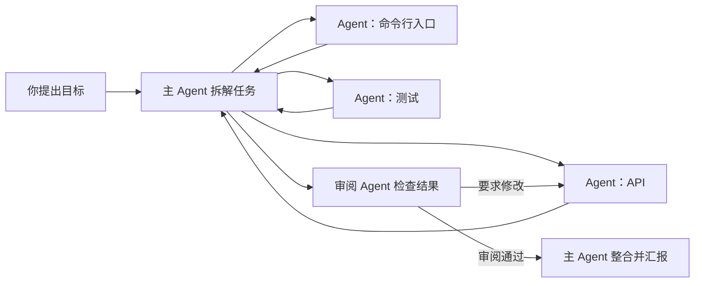

[English](README.md) | **简体中文**

# Warpai

### 为 Agent 协作而生的终端工作空间。

把一次 Agent 会话当作工作的基本单元。在同一个项目中组织多个 Agent，指定一位主 Agent
拆解任务、分派工作、收集结果并整合交付。Warpai 以全功能原生终端为基础，面向 macOS 和 Windows。

**一个项目 · 多个 Agent · 一条协作工作流**

[下载 1.2.0](#get-warpai) · [Agent 如何协作](#agents-as-the-unit-of-work) ·
[支持的 Agent](docs/AGENTS.zh-CN.md) ·
[反馈问题](https://github.com/OthinusG/warpai/issues)

*现有 macOS 原生界面截图，采用垂直标签页和默认 Claude Warm Light 主题。
项目与 Agent 为测试样例；[查看截图来源](docs/images/README.zh-CN.md)。*

## 为 AI 时代重组工作流

Agent 不只是代码旁边的聊天窗口。它可以接手一项具体工作、汇报进展、向其他 Agent 求助，
并把结果交给同伴审阅。Warpai 让多个 Agent 会话共享同一个项目上下文，也给它们一个协同工作的地方。

你可以让多个 Agent 并行处理各自的任务，再指定其中一个作为主 Agent：拆解你的目标、向其他
Agent 下达任务、跟进进度、收回结果并整合交付。审阅者可以要求修改，执行任务的 Agent 修改后
再次提交。你始终决定目标、范围和最终结果。

### 示例：让一支 Agent 团队交付一个功能

例如，你要增加数据导出功能。你可以让主 Agent 规划 API、命令行入口和测试，再把这几项任务
分别交给不同 Agent，最后请另一个 Agent 审阅结果。各 Agent 在同一项目的独立终端会话中工作；
消息、任务分派、进度、验证材料与审阅决定集中呈现。你能看到哪些工作正在进行、哪些已经完成、
哪些还需要返工。

这不要求所有 Agent 都直接改同一批文件。可以在任务中划分职责、明确交付物和验收标准，再由
主 Agent 汇总各方结果。

## 一个工作空间，覆盖从分工到交付

Warpai 把 Agent 管理、项目文件和日常开发工具放在同一应用中，减少在终端、独立 Agent 管理器、
文件浏览器和审阅工具之间来回切换。

- **左侧 Agent 面板：**管理和切换项目中的 Agent 会话，跟进在线状态与任务进度，发送消息、分派任务
  并审阅提交结果。日常协作视图聚焦任务、进展和交付物，历史记录与维护操作在需要时打开。
- **全功能终端：**运行常用 Shell、Git、构建工具、脚本、开发服务器和长时间任务。GPU 渲染、
  命令分块、垂直标签页、分屏、补全、命令搜索、主题和保持唤醒控制，方便并行工作与长时间任务。
- **右侧项目面板：**浏览、创建、重命名和删除项目文件，点击代码或文本即可在内置编辑器中打开，
  使用 Vim 模式，并预览 Markdown 和支持的文件格式。本地与 SSH 项目都跟随当前焦点终端的工作目录。
- **就地 Review：**在 Warpai 内检查代码变更并审阅 Agent 提交。终端、文件、预览和 Review
  保持在同一工作上下文中，方便决定接受结果还是要求修改。本地与远程 Git 变更沿用同一套审阅交互。

Warpai 既能承担 Agent 工作台，也能作为轻量级开发环境；简单编辑、文件预览和 Review 不必再切到
另一个应用。需要深入语言导航、调试器或扩展生态时，仍可与完整 IDE 配合使用。

## 使用你已经选择的 Agent

Warpai 支持 20 多种 CLI Agent 类型，包括 Codex、Claude Code、Gemini、Cursor、Qoder 等。
Agent 继续使用各自的服务商与认证方式，Warpai 提供共同的项目协作工作流。可用性取决于本机安装的
Agent 及版本；当前支持范围见[兼容性指南](docs/AGENTS.zh-CN.md)。

在 **Settings > Features > Agent communication** 中选择允许参与的 Agent。同一项目里的 Agent
可以互发消息、接收委派任务、提交验证材料并参与审阅；不同项目相互隔离。排队任务会等到接收方
Agent 就绪，Warpai 不会代替你处理权限请求。

Agent 无法加入时，设置页会显示具体的设置错误。从 Warp Lite 或旧版 Warpai 升级后，可以用
一键清理移除受支持、已安装 Agent 中的 Warpai 通信配置，保留其他 MCP 服务。清理完成后，
重新启用你希望参与协作的 Agent。

## 远程协作也是这条工作流的一部分

连接 SSH 项目后，可以协调运行在该远程账号和项目中的 Agent。协作面板显示远程项目的 Agent、
消息、任务和连接状态。同一远程项目里的 Agent 可以互发消息、接收任务、提交结果并审阅任务交付。
远端 companion 支持 Linux、macOS 和 Windows，文件传输使用 SFTP。

*现有 SSH 项目原生应用截图。详见[截图来源](docs/images/README.zh-CN.md)。*

这样一支 Agent 团队可以在个人工作站、开发服务器或远程科研机器上继续工作，不必把项目迁入
Warpai 托管的云服务。在终端连接 SSH 后，文件面板会跟随远程 `cd`：在现有 Project Explorer 中
浏览、创建、重命名和删除远程文件，点击代码或文本即可在应用内编辑，预览带远程图片和链接的
Markdown，并将修改保存回原远程文件。Git Review 可以与远程 Agent 团队并排使用，检查修改并
发送反馈，减少在终端、编辑器和文件工具之间切换。切换终端或目录后，已打开的文件仍绑定原远程项目。
其他进程改动文件或连接中断时，未保存的修改会保留；保存冲突需要先处理，不会直接覆盖他人的工作。

例如，连接科研服务器进入分析项目，让不同 Agent 处理数据、检查分析脚本和撰写报告。
你可以在同一应用中打开生成的脚本、预览报告及其嵌入的图片、修改文本并保存到服务器。
数据和计算继续留在远端，任务协调、文件检查与结果审阅则形成完整的一条工作流。

在远程主机安装同一 1.2.0 Release 中的 Companion；之前使用 1.1 的主机也需要更新。
远程文件工具通过 SSH 与 SFTP 工作，支持已验证的 SSH 跳板连接。Git Review 可以检查未提交变更
和可用分支间的差异；提交等 Git 修改操作在远程终端中完成。

## 不止软件开发

只要工作能拆成任务，并能借助 CLI Agent、脚本或项目文件处理，就可以用 Warpai 组织 Agent 团队。
这类工作往往需要研究、分析、撰写和复核，而不需要完整、重量级的编程 IDE。

| 工作类型 | Agent 团队示例 |
| --- | --- |
| **科研与数据分析** | 主 Agent 规划文献梳理；一位 Agent 提取研究方法，另一位分析不同数据集，第三位核对计算和来源。主 Agent 把结果整理成研究笔记或报告。 |
| **写作与知识工作** | 一位 Agent 搭建报告结构，一位搜集支撑材料，另一位检查表达、逻辑与一致性。主 Agent 处理分歧并汇总成稿。 |
| **商业分析与运营** | 分别委派市场或政策研究、数据整理、流程文档和事实核查，再基于材料共同整理决策简报。 |
| **软件开发** | 将实现、测试、文档和代码审阅分给不同 Agent，再由主 Agent 整合通过审阅的成果。 |

你可以让 Python、R、Shell、Git 和现有命令行工具与 Agent 配合工作。Warpai 不要求把科研、
写作、分析或运营工作改造成 IDE 工程，也不把单一模型服务商设为工作中心。

## Warpai 的定位

Zed 和 VS Code 从代码编辑器出发，把 Agent 工作流整合进代码环境。Warpai 从另一端出发：以完整
终端和项目工作空间为基础，把多个独立 CLI Agent 作为主要工作者。它的核心是跨 Agent 的共同协作
闭环——主 Agent 拆解、同伴执行、提交结果、审阅返工、汇总交付；本地与 SSH 项目都适用。

| 对比对象 | Warpai 的工作流侧重 |
| --- | --- |
| **代码编辑器，例如 [Zed](https://zed.dev/docs/ai/overview) 和 [VS Code](https://code.visualstudio.com/docs/agents/overview)** | 以终端和独立 CLI Agent 会话为中心，在项目范围内协调多个 Agent，而不把每个 Agent 都当成编辑器中的独立对话线程。 |
| **AI 终端，例如 [Warp](https://www.warp.dev/terminal)** | 侧重在同一项目中协作调度多种独立安装的 CLI Agent，并提供完整终端与项目工具。 |
| **Agent 工作区，例如 [Conductor](https://www.conductor.build/)** | 使用你安装的 Agent，在本地项目或你选择的 SSH 环境中工作，不依赖 Warpai 托管的云工作区。 |
| **完整 IDE** | 为代码和非代码任务提供终端优先的 Agent 管理、文件工具、预览和 Review；需要专业开发工具时，可与 IDE 配合使用。 |

各产品适合不同工作流。Zed 提供 Agent 面板、并行 Agent 和线程管理；VS Code 将 Agent 与编辑器、
调试器和扩展整合；Warp 同时提供终端、代码编辑及本地和云端 Agent；Conductor 主打云端 Agent 沙箱。
[Zed 官方说明](https://zed.dev/docs/ai/overview)、[VS Code 官方说明](https://code.visualstudio.com/docs/agents/overview)、
[Warp 产品介绍](https://www.warp.dev/terminal)与[Conductor 产品介绍](https://www.conductor.build/)介绍了各自当前的选择。

## 技术栈

Warpai 是使用 **Rust** 编写的原生桌面应用，采用自有 `warpui` UI 工具包、**wgpu** GPU 渲染
和 **winit** 窗口层。Agent 协作状态使用本地 SQLite 存储。桌面应用支持 macOS 和 Windows；
SSH 项目由匹配版本的 Warpai companion 提供远端支持。

## 下载与安装

**[Warpai 1.2.0](https://github.com/OthinusG/warpai/releases/tag/v1.2.0)** 将 Agent 协作、文件管理、
应用内编辑、预览和 Git Review 整合进本地与 SSH 项目的完整工作流。

| 平台 | 下载 | 安装 |
| --- | --- | --- |
| **macOS · Apple 芯片** | [DMG](https://github.com/OthinusG/warpai/releases/download/v1.2.0/Warpai.dmg) | 将 **Warpai.app** 拖入 Applications。 |
| **Windows · x64** | [安装器](https://github.com/OthinusG/warpai/releases/download/v1.2.0/WarpaiSetup-x64.exe) | 运行 **WarpaiSetup-x64.exe**。 |

macOS 应用采用临时签名，尚未进行公证。若首次启动被系统拦截，请确认下载来源后，在
**System Settings > Privacy & Security > Open Anyway** 中批准打开。Windows 可能要求确认
运行未签名安装器。发布页面提供校验和。

### 远程 companion

桌面应用与 companion 应来自同一个 release。安装包清单包含准确源码版本、Rust 目标平台与
SHA-256 校验和。

| 远程主机 | 下载 |
| --- | --- |
| Linux x64（基于 Ubuntu 22.04 构建） | [独立安装包](https://github.com/OthinusG/warpai/releases/download/v1.2.0/WarpaiCompanion-linux-x64.run) |
| macOS Apple 芯片 | [安装镜像](https://github.com/OthinusG/warpai/releases/download/v1.2.0/WarpaiCompanion-macos-arm64.dmg) |
| Windows x64 | [EXE 安装器](https://github.com/OthinusG/warpai/releases/download/v1.2.0/WarpaiCompanion-windows-x64-setup.exe) |

## 本地优先

Warpai 不要求 Warpai 云端账号、登录或订阅，产品中不包含捆绑云端 AI、计费和遥测入口。
你选择的 CLI Agent 继续使用各自的认证与设置；Shell 命令、SSH 连接和 Agent 服务商仍会按照
各自行为使用网络。

## 开发与贡献

从[开发指南](docs/DEVELOPMENT.zh-CN.md)、[Agent 规则（英文）](AGENTS.md)和
[SSH 计划（英文）](specs/agent-communication-v2/PLAN.md)开始。构建和发布直接使用仓库中
已提交的源码。验证及兼容性详情见[发布规范（英文）](specs/RELEASE.md)和
[Agent 兼容性指南](docs/AGENTS.zh-CN.md)。

反馈问题时请提供版本、操作系统、复现步骤与预期行为，省略凭据和私人项目内容。

贡献者必须保留的终端核心路径

保留以下渲染、输入与模型路径。将其整体替换为占位实现，不是有效的编译修复；需要同时验证终端行为。

- `app/src/terminal/view.rs`
- `app/src/terminal/input.rs`
- `app/src/terminal/block_list_element.rs`
- `app/src/terminal/view/`
- `app/src/terminal/input/`
- `app/src/terminal/local_tty/terminal_manager.rs`
- `app/src/terminal/alt_screen/alt_screen_element.rs`
- `app/src/terminal/model/`

## 致谢与许可证

Warpai 独立维护，源自 [terzigolu/warp-lite](https://github.com/terzigolu/warp-lite)
与 [Warp](https://github.com/warpdotdev/warp)，与上游 Warp 团队没有隶属或背书关系，保留原有版权与署名。

源码采用 [AGPL-3.0-only](LICENSE-AGPL)；原始 `warpui`、`warpui_core` 子库保留
[MIT 许可证](LICENSE-MIT)。出处与商标说明见 [fork notice（英文）](FORK_NOTICE.md)。
