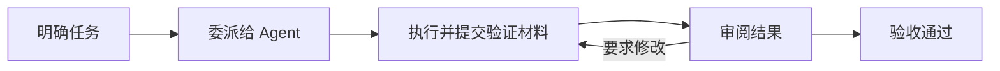

<div align="center">

[English](README.md) | **简体中文**

# Warpai

### 你的终端，你的项目，你的 Agent。

面向 macOS 和 Windows 的本地优先终端，
把日常开发与你自己的 CLI Agent 协作放进同一个工作空间。

**命令分块 · GPU 渲染 · 项目浏览 · Agent 协作 · SSH 项目**

[下载与安装](#get-warpai) ·
[Agent 使用与兼容性](docs/AGENTS.zh-CN.md) ·
[快速开始](#start-working) ·
[反馈问题](https://github.com/OthinusG/warpai/issues)

[](LICENSE-AGPL)
[](#get-warpai)
[](#work-on-remote-projects)

</div>

Warpai 将命令、项目文件和 Agent 对话集中到原生工作空间中。
运行构建、查看输出、浏览源码，再把一项明确的任务交给 Agent，整个过程都围绕你的项目展开。

打开应用就能进入终端，继续使用熟悉的 Shell 和 CLI 工具。
需要协作时再接入自己的 Agent，自行选择服务商并完成认证。


*采用默认 Claude Warm Light 主题、启用垂直标签页的 macOS 原生界面，展示源码编辑器与任务详情面板。截图使用样例项目。
[查看截图来源](docs/images/README.zh-CN.md)。*

## 为什么选择 Warpai

| 你关心的事 | Warpai 提供什么 |
| --- | --- |
| **看清命令与结果** | 每条命令与输出保留在同一个命令块中。标签页、分屏和 GPU 渲染支持持续运行的构建与并行工作。 |
| **自己选择工具** | 使用独立安装的 Codex、Claude Code、QoderCN 等 CLI Agent，自行选择并认证服务商。 |
| **任务协作有记录** | 同一项目中的参与 Agent 可以互发消息、委派任务、提交验证材料并审阅结果。 |
| **工作空间紧贴代码** | 在原生应用中浏览项目文件、打开源码和 Markdown、使用 Vim 模式，并切换终端。 |
| **协作由你掌控** | 无需 Warpai 账号或托管协作服务。本地项目在本机协调，SSH 项目在选定的远程账号内协调。 |
| **中断后仍然看得清** | 保留未发送的草稿，标明过期的远程状态，并在验收前审阅结果。远程断线时禁止写操作。 |

## 为日常开发准备的终端

继续在 Shell 中使用 Git、脚本、包管理器、构建工具、测试工具和远程命令。
命令块方便回看输出；标签页与分屏让开发服务器、测试进程和工作终端各有位置。

项目浏览器让文件触手可及。编辑器、Vim 模式、命令面板、补全与 Markdown 查看器，
帮助你在命令和代码上下文之间切换。可以选择浅色或深色主题，并调整字体。

长时间运行 Agent 时，可开启当前会话的 **Keep awake（保持唤醒）**。
它只在被跟踪的 Agent 正在工作时阻止系统因空闲进入睡眠，屏幕仍可休眠；
重启应用后，这个开关会重置。

## 让自己的 Agent 一起工作

让一个 Agent 实现功能，另一个 Agent 审查结果。
任务要求、执行状态、提交的验证材料和审阅决定都保留在同一个项目中，便于跟进每次交接。



- **消息与任务：** 发送明确请求、委派工作，并查看当前状态。
- **提交与验收：** 提交结果后仍需审阅，提交本身不等于验收通过。
- **项目边界：** 同一规范化项目中的参与 Agent 可以通信，无关项目保持隔离。
- **保护当前交互：** 排队任务保留你的输入草稿，不会代答 Agent 的权限请求。消息投递不等于确认收到或工作完成。

协作依赖 CLI 的原生 MCP 支持，具体可用性取决于已安装的 CLI 及版本。
“能在终端运行”和“能参与 Agent 协作”是两项能力。
配置方式与验证范围见 [Agent 使用与兼容性指南](docs/AGENTS.zh-CN.md)。

<a id="start-working"></a>

### 快速开始

1. 从下方下载表中选择包含 Agent 协作的构建。
2. 使用各 CLI 自己的工具安装并认证 Agent。
3. 打开 **Settings > Features > Agent communication**，勾选允许参与的 Agent。
4. 在同一项目中新开 Agent 会话；不支持热加载 MCP 配置的 CLI 需要重启已有会话。
5. 打开 **Agent collaboration**，查看 Agent、交换消息并跟进任务。

关闭协作或取消勾选某个 Agent，会立即撤销其当前访问权限。
Warpai 只清理自己拥有的配置，保留用户的其他设置。

<a id="work-on-remote-projects"></a>

## 在 SSH 项目中继续协作

选定 SSH 项目后，仍然使用同一个协作面板。
同一远程账号、同一项目中的 Agent 共享远程协调服务；
你可以在桌面端查看消息、任务和连接状态。


*采用默认 Claude Warm Light 主题、启用垂直标签页的 macOS 原生 SSH 面板，使用受控样例 Agent。
远程位置与当前任务同时可见。*

1. 用系统 OpenSSH 配置可信的主机别名，并确认非交互认证可正常工作。
2. 将匹配版本的 **Warpai companion** 放到远程账号中，并在远端安装、认证 CLI Agent。
3. 打开 **Agent collaboration > Connect SSH project**，填写 SSH 别名、项目绝对路径和 companion 的安装路径。
4. 在普通 SSH 终端中通过 companion 启动每个受管理 Agent，使用同一个规范化项目根目录。

```sh
/opt/warpai/warpai-companion agent /srv/project codex /usr/local/bin/codex
```

把示例路径替换为远程主机上的实际路径。
关闭该 SSH 连接会停止它拥有的 Agent 运行。断线后使用 **Reconnect** 重新连接；
未发送的表单会保留，重新连接前禁止写操作。桌面端凭据不会复制到远程账号。

远程项目支持 **Linux、macOS 和 Windows**。
每个选定项目都有独立权限边界，不会自动把不同主机、本地项目和远程项目合并成同一协作空间。
相关实现与验证见 [SSH 技术说明（英文）](specs/agent-communication-v2/TECH.md)
和 [验收记录（英文）](specs/agent-communication-v2/QUALITY.md)。

<a id="get-warpai"></a>

## 下载与安装

**Warpai 目前处于 Alpha 阶段。** 请根据想体验的功能选择构建：

| 构建 | 包含功能 | 下载入口 |
| --- | --- | --- |
| **已发布版本 — `v0.5.7-lite`** | 终端基础功能。安装包保留历史名称 **WarpLite**，不包含当前 Agent 协作与 SSH 扩展。 | [macOS 应用 ZIP、DMG；Windows x64 安装器、便携 ZIP](https://github.com/OthinusG/warpai/releases/tag/v0.5.7-lite) |
| **已通过验收的 Warpai 试用构建** | 当前本地 Agent 协作与 SSH 项目面板。macOS 和 Windows 的桌面检查、原生操作及截图检查均通过。 | [桌面安装包](https://github.com/OthinusG/warpai/actions/runs/37152975773) · [匹配的远程 companion](https://github.com/OthinusG/warpai/actions/runs/37152973196) |

安装已发布版本时，在 macOS 中将 DMG 内的 **WarpLite.app** 拖入 Applications。
在 Windows 中运行 **WarpLiteSetup-x64.exe**，或解压便携 ZIP 后运行 **WarpLite.exe**。

体验协作功能时，下载试用构建中的 **Warpai-agent-communication-macos**
或 **Warpai-agent-communication-windows** 产物。
先解压下载的外层文件，再打开其中的应用 ZIP、安装器或便携 ZIP。
GitHub Actions 产物下载可能要求登录 GitHub，且有保留期限；
链接中的产物过期后，请选择一次成功的 [当前验证构建](https://github.com/OthinusG/warpai/actions/workflows/validate-agent-communication.yml)。
远程 companion 的源码清单应与所选桌面构建匹配。

工程验收包括真实原生进程和受控 OpenSSH 下的消息、任务及审阅测试，
未覆盖每个已认证服务商版本或每台实体远程主机。
试用构建的具体范围见 [详细验收记录（英文）](specs/agent-communication-v2/QUALITY.md)。

## 本地优先

打开 Warpai 无需 Warpai 账号、登录或订阅。
默认产品排除捆绑的云端 AI、云账号、计费流程和遥测产品入口；
本地命令与项目协调无需 Warpai 云服务。

你运行的命令、SSH 会话和独立安装的 Agent 仍然可以访问网络。
Agent 服务商有各自的账号、定价与数据政策。
已删除无用的历史 AI 搜索实现、上游内置 AI 技能和没有调用方的云端发布脚本。
终端、编辑器、本地 CLI 集成和历史数据兼容仍需要的共享代码继续保留，
具体范围见 [源码清理记录（英文）](specs/DEEP-CLEANUP.md)。

<a id="develop-and-contribute"></a>

设置、主题、MCP 配置和本地应用数据统一存放在 macOS 的
`~/.config/.warpai` 与 Windows 的 `%USERPROFILE%\.config\.warpai`。
首次启动会导入旧目录中缺少的设置，不覆盖新文件；旧目录保留供恢复。
第三方 Agent 的配置仍存放在各自原有位置。

## 开发与贡献

Warpai 使用 Rust 编写，在本仓库直接维护。
从 [中文开发指南](docs/DEVELOPMENT.zh-CN.md)、[项目规则（英文）](AGENTS.md)
和 [当前 SSH 计划（英文）](specs/agent-communication-v2/PLAN.md) 开始了解项目。
构建与验证工作流使用本仓库已提交的源码。

反馈问题时，请提供构建或源码版本、操作系统、复现步骤和预期行为。
不要在报告中包含 token、凭据或私人项目内容。

<details>
<summary>贡献者须保留的终端核心代码</summary>

保留以下渲染、输入与模型路径。
用整片占位实现替换它们以通过编译，不是有效修复；需要同时验证终端行为与构建。

- `app/src/terminal/view.rs`
- `app/src/terminal/input.rs`
- `app/src/terminal/block_list_element.rs`
- `app/src/terminal/view/`
- `app/src/terminal/input/`
- `app/src/terminal/local_tty/terminal_manager.rs`
- `app/src/terminal/alt_screen/alt_screen_element.rs`
- `app/src/terminal/model/`

</details>

## 致谢与许可证

Warpai 独立维护，源自 [terzigolu/warp-lite](https://github.com/terzigolu/warp-lite)
与 [Warp](https://github.com/warpdotdev/warp)。
本项目与上游 Warp 团队没有隶属或背书关系，保留原有版权与归属声明。

源码使用 [AGPL-3.0-only 许可证](LICENSE-AGPL)。
原有 `warpui` 和 `warpui_core` crate 保留 [MIT 许可证](LICENSE-MIT)。
出处与商标信息见 [派生项目说明（英文）](FORK_NOTICE.md)，许可证以原始文件为准。
