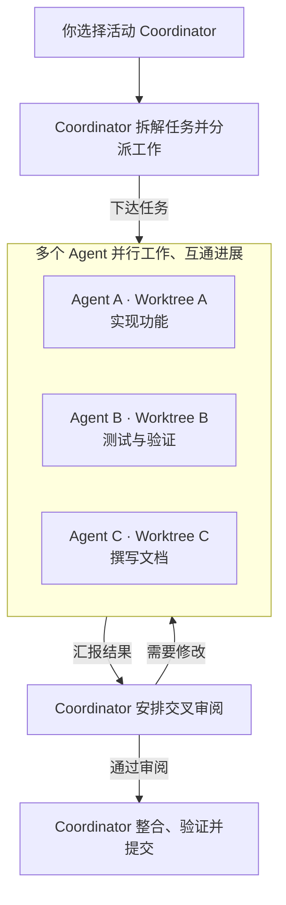

[English](README.md) | **简体中文**

# Warpai

### 为 Agent 协作而生的终端工作空间。

把一次 Agent 会话当作工作的基本单元。在项目中共享协作，或选择一位 Coordinator，
让多个 Agent 在独立 Git worktree 中并行开发。Warpai 以全功能原生终端为基础，桌面支持 macOS 和 Windows，
在远程 Linux、macOS 和 Windows 上也能保持同样的 Agent、文件和审阅工作流。

**一个项目 · 多个 Agent · 一条协作工作流**

[下载 1.5.5](#get-warpai) · [Agent 如何协作](#agents-as-the-unit-of-work) ·
[支持的 Agent](docs/AGENTS.zh-CN.md) ·
[反馈问题](https://github.com/OthinusG/warpai/issues)

*现有 macOS 原生界面截图，采用垂直标签页和默认 Claude Warm Light 主题。
项目与 Agent 为测试样例；[查看截图来源](docs/images/README.zh-CN.md)。*

## 为 AI 时代重组工作流

Agent 不只是代码旁边的聊天窗口。它可以接手一项具体工作、汇报进展、向其他 Agent 求助，
并把结果交给同伴审阅。Warpai 让多个 Agent 会话共享同一个项目上下文，也给它们一个协同工作的地方。

科研、写作和共享项目通信可以使用 **Project** 模式，消息、任务和历史集中在项目中。
同一 Git 仓库的并行开发可以使用 **Worktree** 模式：从任意 worktree 的在线 Agent 中选择 Coordinator。
同仓库的 Agent 自动参与，同一 worktree 内可以直接通信，不同 worktree 通过 Coordinator 通信。Coordinator 负责拆解任务、传递上下文、收集结果、
安排交叉审阅并决定集成哪些成果。审阅者可以要求修改，执行任务的 Agent 修改后再次提交。
你始终决定目标、范围和最终结果。

### 示例：让一支 Agent 团队交付一个功能

例如，增加数据导出功能时，切换到 Worktree 模式并选择 Coordinator，为 API、命令行入口
和测试通过原有 worktree 入口分别创建新 tab，再在对应目录启动 Agent；
创建 worktree 不会启动 Agent。Coordinator 分派任务、要求 Agent 互相审阅，再整合通过审阅的
结果、验证组合后的改动并完成最终 Git 提交。消息、任务、验证材料和审阅决定贯穿整个过程。

科研、分析、撰写和事实核查可以继续使用 Project 模式：划分任务、汇总交付，无需配置 worktree。

## 一个工作空间，覆盖从分工到交付

Warpai 把 Agent 管理、项目文件和日常开发工具放在同一应用中，减少在终端、独立 Agent 管理器、
文件浏览器和审阅工具之间来回切换。

- **左侧 Agent 面板：**管理和切换项目中的 Agent 会话，跟进在线状态与任务进度，发送消息、分派任务
  并审阅提交结果。在协作面板顶部切换 Project / Worktree，从任意 checkout 选择或切换 Coordinator；
  创建 worktree 使用原有入口并打开新 tab，紧凑摘要可以展开查看目录详情。
- **全功能终端：**运行常用 Shell、Git、构建工具、脚本、开发服务器和长时间任务。GPU 渲染、
  命令分块、垂直标签页、分屏、补全、命令搜索、主题和保持唤醒控制，方便并行工作与长时间任务。
- **右侧项目面板：**浏览、创建、重命名和删除项目文件，点击代码或文本即可在内置编辑器中打开，
  使用 Vim 模式，并预览 Markdown 和支持的文件格式。本地与 SSH 项目都跟随当前焦点终端的工作目录。
- **审阅 Agent 结果：**查看提交的文件和报告，在协作面板中验收任务或要求修改。
- **Code Review：**在原有面板中查看本地或 SSH 仓库的 Git 差异，并在现有编辑器中打开
  变更文件。远程 Git 写操作继续在 SSH 终端中完成。

Warpai 既能承担 Agent 工作台，也能作为轻量级开发环境；简单编辑、文件预览和任务验收不必再切到
另一个应用。需要深入语言导航、调试器或扩展生态时，仍可与完整 IDE 配合使用。

## 使用你已经选择的 Agent

Warpai 支持 20 多种 CLI Agent 类型，包括 Codex、Claude Code、Gemini、Cursor、Qoder 等。
Agent 继续使用各自的服务商与认证方式，Warpai 提供共同的项目协作工作流。可用性取决于本机安装的
Agent 及版本；当前支持范围见[兼容性指南](docs/AGENTS.zh-CN.md)。

在 **Settings > Features > Agent communication** 中选择允许参与的 Agent。同一项目里的 Agent
可以互发消息、接收委派任务、提交验证材料并参与审阅；不同项目相互隔离。排队任务会等到接收方
Agent 就绪，Warpai 不会代替你处理权限请求。

先通过原有流程启动 Agent，再选择 Coordinator。没有活动 Agent 时，Worktree 协调操作不可用。
参与关系跟随 Agent 实际所在的 checkout，不会移动或重启进程。Coordinator 可随时切换，
选择在切换 pane、tab 和 project 后仍保留，直到该 Agent 退出或 Warpai 关闭。
模式切换只改变面板视图并保留 Project 历史；接受任务不会自动合并分支。

Agent 无法加入时，设置页会显示具体的设置错误。一键清理可以移除受支持、已安装 Agent 中的
Warpai 通信配置，保留其他集成设置，方便重新选择参与协作的 Agent。

协作面板底部的 **Data usage** 显示已连接服务商账户的用量。在
**Settings > Features > Data usage** 中添加账户并选择显示项。用量区域独立滚动，
最多显示四行，浏览任务时仍可查看账户名称、Agent 图标、配额进度条和可用余额。
账户配置跨工作区和重启保留；重启后重新获取用量。认证使用本机 CLI 当前登录或保存在
系统安全存储中的凭据。[服务商指南](specs/agent-communication-v2/USAGE-PROVIDERS.md)列出可用来源。

## 远程也能完成同样的工作流

**本地与远端保持同样的工作体验：**Agent 管理与协作、完整终端、文件管理、应用内编辑和文档预览
都可以在远程项目中使用。在终端连接 Linux、macOS 或 Windows 主机，进入项目目录后，
工作空间就会跟随该终端的远程 `cd`。

远程协作视图同样支持 Project / Worktree，显示 Agent、消息、任务和结果。在同一 SSH 主机、
账号内，可以像本地一样从任意 checkout 选择或切换 Coordinator。各 worktree
保持自己的文件、编辑器和 Review 根目录；独立 clone、不同主机或账号、本地与远程环境相互隔离。

*现有 SSH 项目原生应用截图。详见[截图来源](docs/images/README.zh-CN.md)。*

Project Explorer 可以浏览远程项目，创建、重命名和删除文件。点击代码或文本，就能在原有内置
编辑器中打开；报告可以直接预览 Markdown、图片和链接，修改后保存到远程主机。切换目录或终端后，已打开的文件仍绑定
原远程项目；连接中断或保存冲突时，未保存的修改会保留。

例如，连接科研服务器进入分析项目，让一位 Agent 处理数据、一位检查分析脚本，另一位撰写报告。
它们工作时，你可以在 Warpai 中打开生成的脚本，预览带图表的报告，审阅修改并直接修正内容。
主 Agent 再把结果整理成最终交付。数据与计算留在服务器上，任务协调、文件检查、预览和审阅仍在
同一个应用中完成。

远程开发机可使用 Worktree 模式，在隔离目录中分别实现功能、运行测试和维护文档；检查文件与
变更后，由 Coordinator 整合并提交通过审阅的结果。科研团队仍可使用 Project 模式，无需创建 worktree。

## 不止软件开发

只要工作能拆成任务，并能借助 CLI Agent、脚本或项目文件处理，就可以用 Warpai 组织 Agent 团队。
这类工作往往需要研究、分析、撰写和复核，而不需要完整、重量级的编程 IDE。

| 工作类型 | Agent 团队示例 |
| --- | --- |
| **科研与数据分析** | 主 Agent 规划文献梳理；一位 Agent 提取研究方法，另一位分析不同数据集，第三位核对计算和来源。主 Agent 把结果整理成研究笔记或报告。 |
| **写作与知识工作** | 一位 Agent 搭建报告结构，一位搜集支撑材料，另一位检查表达、逻辑与一致性。主 Agent 处理分歧并汇总成稿。 |
| **商业分析与运营** | 分别委派市场或政策研究、数据整理、流程文档和事实核查，再基于材料共同整理决策简报。 |
| **软件开发** | 使用 Worktree 模式，将实现、测试和文档分给独立 checkout 中的 Agent，由明确选择的 Coordinator 安排交叉审阅、集成成果并完成最终提交。 |

你可以让 Python、R、Shell、Git 和现有命令行工具与 Agent 配合工作。Warpai 不要求把科研、
写作、分析或运营工作改造成 IDE 工程，也不把单一模型服务商设为工作中心。

## Warpai 的定位

Zed 和 VS Code 从代码编辑器出发，把 Agent 工作流整合进代码环境。Warpai 从另一端出发：以完整
终端和项目工作空间为基础，把多个独立 CLI Agent 作为主要工作者。它的核心是跨 Agent 的共同协作
闭环——主 Agent 拆解、同伴执行、提交结果、审阅返工、汇总交付；本地与 SSH 项目都适用。

| 对比对象 | Warpai 的工作流侧重 |
| --- | --- |
| **代码编辑器，例如 [Zed](https://zed.dev/docs/ai/overview) 和 [VS Code](https://code.visualstudio.com/docs/agents/overview)** | 以终端和独立 CLI Agent 会话为中心，在项目范围内协调多个 Agent，而不把每个 Agent 都当成编辑器中的独立对话线程。 |
| **AI 终端，例如 [Warp](https://www.warp.dev/terminal)** | 侧重在同一项目中协作调度多种独立安装的 CLI Agent，并提供完整终端与项目工具。 |
| **Agent 工作区，例如 [Conductor](https://www.conductor.build/)** | 使用你安装的 Agent，在本地项目或你选择的 SSH 环境中工作，不依赖 Warpai 托管的云工作区。 |
| **完整 IDE** | 为代码和非代码任务提供终端优先的 Agent 管理、文件工具、预览和任务验收；需要专业开发工具时，可与 IDE 配合使用。 |

各产品适合不同工作流。Zed 提供 Agent 面板、并行 Agent 和线程管理；VS Code 将 Agent 与编辑器、
调试器和扩展整合；Warp 同时提供终端、代码编辑及本地和云端 Agent；Conductor 主打云端 Agent 沙箱。
[Zed 官方说明](https://zed.dev/docs/ai/overview)、[VS Code 官方说明](https://code.visualstudio.com/docs/agents/overview)、
[Warp 产品介绍](https://www.warp.dev/terminal)与[Conductor 产品介绍](https://www.conductor.build/)介绍了各自当前的选择。

## 技术栈

Warpai 是使用 **Rust** 编写的原生桌面应用，采用自有 `warpui` UI 工具包、**wgpu** GPU 渲染
和 **winit** 窗口层。Agent 协作状态使用本地 SQLite 存储。桌面应用支持 macOS 和 Windows；
SSH 项目由匹配版本的 Warpai companion 提供远端支持。

## 下载与安装

**[Warpai 1.5.5](https://github.com/OthinusG/warpai/releases/tag/v1.5.5)** 将 Agent 协作、文件管理、
应用内编辑和预览整合进本地与 SSH 项目的完整工作流。

| 平台 | 下载 | 安装 |
| --- | --- | --- |
| **macOS 11.0（Big Sur）或更高版本 · Apple 芯片** | [DMG](https://github.com/OthinusG/warpai/releases/download/v1.5.5/Warpai-1.5.5-macos-arm64.dmg) | 将 **Warpai.app** 拖入 Applications。 |
| **Windows · x64** | [安装器](https://github.com/OthinusG/warpai/releases/download/v1.5.5/WarpaiSetup-1.5.5-windows-x64.exe) | 运行安装器。 |

macOS 应用采用临时签名，尚未进行公证。若首次启动被系统拦截，请确认下载来源后，在
**System Settings > Privacy & Security > Open Anyway** 中批准打开。Windows 可能要求确认
运行未签名安装器。发布页面提供校验和。

在 **Settings > About** 点击 **Update** 检查新版本。发现新版后，**Download**
会打开当前平台安装包的下载直链。开启 **Check for updates on startup** 后，
Warpai 每次启动检查一次更新。下载后按上方说明安装。

### 远程 companion

**Warpai Companion 4.0.0** 为远程 Linux、macOS 和 Windows 主机提供项目工作空间。
组件自带私有 Git；Warpai 的文件、Review 和 Agent 通信基础功能无需另装 Git、Python、
Node、tmux 或 socat。第三方 Agent 仍使用各自的运行环境。Companion 按需启动，
空闲 60 秒自动退出。按你要连接的远程主机选择安装包。

| 远程主机 | 下载 |
| --- | --- |
| Linux x64（基于 Ubuntu 22.04 构建） | [独立安装包](https://github.com/OthinusG/warpai/releases/download/v1.5.5/WarpaiCompanion-4.0.0-linux-x64.run) |
| macOS 11.0（Big Sur）或更高版本 · Apple 芯片 | [安装镜像](https://github.com/OthinusG/warpai/releases/download/v1.5.5/WarpaiCompanion-4.0.0-macos-arm64.dmg) |
| Windows x64 | [EXE 安装器](https://github.com/OthinusG/warpai/releases/download/v1.5.5/WarpaiCompanion-4.0.0-windows-x64-setup.exe) |

## 本地优先

Warpai 不要求 Warpai 云端账号、登录或订阅，产品中不包含捆绑云端 AI、计费和遥测入口。
你选择的 CLI Agent 继续使用各自的认证与设置；Shell 命令、SSH 连接和 Agent 服务商仍会按照
各自行为使用网络。

## 开发与贡献

从[开发指南](docs/DEVELOPMENT.zh-CN.md)、[Agent 规则（英文）](AGENTS.md)和
[SSH 计划（英文）](specs/agent-communication-v2/PLAN.md)开始。构建和发布直接使用仓库中
已提交的源码。验证及兼容性详情见[发布规范（英文）](specs/RELEASE.md)和
[Agent 兼容性指南](docs/AGENTS.zh-CN.md)。

反馈问题时请提供版本、操作系统、复现步骤与预期行为，省略凭据和私人项目内容。

贡献者必须保留的终端核心路径

保留以下渲染、输入与模型路径。将其整体替换为占位实现，不是有效的编译修复；需要同时验证终端行为。

- `app/src/terminal/view.rs`
- `app/src/terminal/input.rs`
- `app/src/terminal/block_list_element.rs`
- `app/src/terminal/view/`
- `app/src/terminal/input/`
- `app/src/terminal/local_tty/terminal_manager.rs`
- `app/src/terminal/alt_screen/alt_screen_element.rs`
- `app/src/terminal/model/`

## 致谢与许可证

Warpai 独立维护，源自 [terzigolu/warp-lite](https://github.com/terzigolu/warp-lite)
与 [Warp](https://github.com/warpdotdev/warp)，与上游 Warp 团队没有隶属或背书关系，保留原有版权与署名。

源码采用 [AGPL-3.0-only](LICENSE-AGPL)；原始 `warpui`、`warpui_core` 子库保留
[MIT 许可证](LICENSE-MIT)。出处与商标说明见 [fork notice（英文）](FORK_NOTICE.md)。
