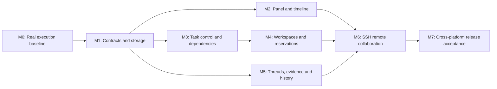

# Agent Collaboration Implementation Plan

Date: 2026-10-01. Baseline: `7d2eac7` (source repair `632bd1c`). Status: plan drafted and structurally validated; all implementation work below remains pending.

## Reading order and scope

1. [PRODUCT.md](PRODUCT.md): user-visible behavior, B01–B30.
2. [TECH.md](TECH.md): architecture, migration, failure handling and acceptance tests.
3. [API.md](API.md): state transitions, operations and transport contracts.
4. This file: execution order, work packages, release gates and estimates.

This plan covers the seven previously identified gaps plus remote communication. Existing implementation and earlier acceptance records remain in [the v1 specification](../agent-communication/TECH.md) and [coverage record](../agent-communication/COVERAGE.md). The new documents do not declare those gaps implemented. No production code or external service is changed by writing this plan.

## Coverage and priorities

| Gap | Deliverable | Behavior | Work packages |
| --- | --- | --- | --- |
| Real execution acceptance | Reproducible two-agent tasks, wake/rework evidence, version matrix | B07–B12, B30 | M0, M7 |
| Collaboration visibility | Native panel, blocked reasons, event timeline, user controls | B02–B06 | M1, M2 |
| Cancellation/failure/timeouts | Explicit outcomes, fenced attempts, controlled retry/reassignment | B09–B12 | M1, M3 |
| File/worktree conflicts | Advisory reservations and explicit workspace grouping | B16–B17 | M4 |
| Dependencies/task scheduling | Cycle-checked dependencies and atomic claims | B13–B15 | M3 |
| Threads/structured evidence | Reply history, search, provenance-bearing result references | B18–B20 | M1, M5 |
| Long-running history | Row-based storage, pagination, archival, bounded retry retention | B21, B29 | M1, M5 |
| Remote communication | Enrolled devices, SSH channel, project grants, reconciliation | B22–B28 | M4, M6, M7 |

Priority: first prove the existing execution path (M0); establish durable contracts (M1); make local operation visible and controllable (M2/M3); add collaboration scope and evidence (M4/M5); then connect machines (M6). Release local improvements before remote availability if their gates pass.

## Work packages

Each package produces a reviewable commit/PR with updated specifications, focused tests and an acceptance record. Start sequentially with one owner; independent work is possible after shared contracts stabilize, but this plan does not authorize spawning agents automatically.

### M0 — Establish a real execution baseline

- [ ] **M0.1:** Verify the prior repair workflow result and package provenance; install a matching review build into a separate test location. Do not assume a downloaded companion updates the installed app.
- [ ] **M0.2:** Move the useful parts of temporary native probes into a focused, credential-free acceptance harness. Give it a disposable repository, exact executable paths, recorded versions, bounded runtime and cleanup of only its own children. User startup/permission prompts remain observable.
- [ ] **M0.3:** Run deterministic fixture tasks through the actual Warpai UI: issuer assigns a tiny source edit and test; receiver wakes, calls TaskStart, edits, tests and submits; issuer requests one revision, then accepts. Capture task IDs, states, evidence and receiver screen activity, not raw secrets or unrelated transcripts.
- [ ] **M0.4:** Exercise busy, draft, approval, manual pause, process replacement, receiver crash and app restart. Classify each failure as bridge, lifecycle, PTY, model compliance or configuration; fix the shared cause before adding feature layers.
- [ ] **M0.5:** Cover both roles for each locally installed eligible CLI using a known-good counterpart; include Codex shared-daemon isolation, QoderCN separately from Qoder and Antigravity discovery fallback. Record absent vendors as unverified. Repeat real execution on Windows before claiming Windows native acceptance.
- **Exit:** C01/C02 in TECH pass for tested versions; no claim of universal model obedience. Unavailable credentials or machines block the corresponding release claim, not unrelated design work.

### M1 — Durable storage, events and versioned contracts

- [ ] **M1.1:** Translate API.md into serde operation contracts and schema-derived MCP tools. Preserve the existing twelve tool names and required fields; add optional fields/new tools with explicit feature negotiation.
- [ ] **M1.2:** Add versioned SQLite migrations and normalized task, attempt, message, event and idempotency rows. Use existing Diesel/SQLite. Keep runtime terminal bindings in memory and separate from durable collaboration identities.
- [ ] **M1.3:** Add atomic event emission with each mutation, paginated read APIs, stable error codes, attempt fencing and optimistic versions for new control operations. Record observed delivery phases separately from authoritative task outcomes.
- [ ] **M1.4:** Migrate a v1 snapshot with a tested backup/restore path and downgrade guard. Include full-capacity, malformed, interrupted and disk-full fixtures. Do not drop the only copy of old data.
- [ ] **M1.5:** Implement bounded mutation epochs and deduplication retention so cleanup cannot make an old request execute again. Add non-destructive capacity reporting.
- **Exit:** C03/C04/C10 pass on macOS and Windows; old-data migration and stale replay rejection are proven before the new UI writes data.

### M2 — Native collaboration panel

- [ ] **M2.1:** Add `Agent collaboration` to the existing Tools Panel and persisted panel selection. Build fixed fixtures for all B02/B04/B06 states using existing components and themes.
- [ ] **M2.2:** Review macOS/Windows screenshots at narrow/wide widths, light/dark themes and increased text size; verify keyboard navigation, focus restoration, accessibility labels and long-content wrapping. Fix static states before live integration.
- [ ] **M2.3:** Subscribe to local event updates, with paginated task/agent queries and a recoverable cursor. Show current space/device, task detail, timeline and why work is waiting. Do not poll full history every UI frame.
- [ ] **M2.4:** Wire human operations through the authenticated local controller using a distinct operator principal. Add local-terminal focus and stale/offline states; enable controls only when their APIs have shipped.
- **Exit:** C05 plus existing terminal regression checks; typing in a terminal cannot be interrupted by panel refresh or delayed actions.

### M3 — Task control and dependencies

- [ ] **M3.1:** Implement failure, cancellation request/confirmation, deadlines and interrupted-attempt recovery. Keep cancellation state separate from process liveness. Surface unsupported native interrupt behavior honestly.
- [ ] **M3.2:** Add explicit retry/reassignment with new attempt IDs and concurrency checks. Preserve prior evidence. Require acknowledged stop, observed exit or explicit human override before overlapping ownership is possible.
- [ ] **M3.3:** Add dependency edges, cycle validation and accepted-prerequisite checks in the same transaction as start/claim. Resolve failed prerequisites visibly. Use stable FIFO eligibility; omit an automatic model-ranking system.
- [ ] **M3.4:** Add unassigned tasks with explicit eligible participants, atomic claim, one active delegated attempt per agent and deterministic wake of an eligible idle candidate. Re-evaluate eligibility when presence/dependencies change; claiming remains the authority.
- [ ] **M3.5:** Update MCP cooperation instructions and panel controls; observe missing model acknowledgements without faking execution or silently looping prompts.
- **Exit:** C06/C07; race tests cover start/cancel, submit/cancel, review/retry, claim/claim and dependent-start/prerequisite change.

### M4 — Collaboration spaces and file reservations

- [ ] **M4.1:** Introduce explicit collaboration spaces and local workspace mappings. Default each existing canonical project to its private space. Existing worktrees do not become connected merely because their Git remote matches.
- [ ] **M4.2:** Add join/leave controls with a preview of exposed participants and scope. Begin with new sessions in the shared space; keep active private tasks in their original space.
- [ ] **M4.3:** Add expiring exact-file/subtree reservations using checkout identity, platform path semantics and task/attempt ownership. Reject overlapping exclusive reservations in one checkout; warn on logical overlap in distinct worktrees.
- [ ] **M4.4:** Show conflicts, renewal, release and abandoned-owner handling in MCP and UI. Expiry releases a coordination record, never asserts that OS file writes have stopped. No automatic git checkout, reset, merge or branch deletion.
- **Exit:** C08; test symlinks, path escapes, macOS/Windows case behavior, device-qualified workspaces and worktree opt-in isolation.

### M5 — Threads, evidence and sustainable history

- [ ] **M5.1:** Add subjects, reply/thread/task linkage and cursor-based thread retrieval/search. Preserve immutable original messages and append follow-up corrections.
- [ ] **M5.2:** Add bounded evidence descriptors for files, commits, diffs and test outcomes. Validate repository-relative paths and distinguish reported from locally verified evidence. Resolve local references through existing file viewing; remote metadata is not fetched content.
- [ ] **M5.3:** Implement archival, filtered export, explicit purge previews, retry cleanup and disk-budget reporting. Retain unresolved work and dependency/retry references. Validate search after migration and archive transitions.
- [ ] **M5.4:** Benchmark representative history on both platforms; tune indexed queries before adding caches or services. Add practical message rate/backpressure limits and actionable quota errors.
- **Exit:** C09/C10; no secret capture, silent data eviction or resurrection of old mutations after cleanup.

### M6 — Remote coordination over SSH

- [ ] **M6.1:** Validate the system OpenSSH remote-stdio path on macOS and Windows, including executable discovery, authentication, known hosts, spaces in install paths and clean protocol stdout. Keep authentication UI separate from protocol traffic.
- [ ] **M6.2:** Add the narrow `warp-agent remote-stdio` gateway and authenticated local app control endpoint. Both host and participant applications must be running; the gateway is not a model or shell-command execution API.
- [ ] **M6.3:** Add one-time enrollment, device credentials in platform secure storage, explicit space grants and revocation. Keep terminal capabilities on their originating machine. Fail closed on missing/locked secure storage.
- [ ] **M6.4:** Implement hello/version negotiation, bound device identity, presence epochs, heartbeats, event resume and durable pending operations. Authoritative task state exists only on the coordinator; participant caches are read projections.
- [ ] **M6.5:** Route shared-space MCP operations to the coordinator, and route wake notifications back to the receiving app's existing guarded terminal path. Reuse local operations and state machine rather than implementing a second remote task engine.
- [ ] **M6.6:** Add Devices/Connection status within communication settings, workspace mapping, grant review, reconnect diagnostics and connection removal. SSH/server prerequisites remain explicit; do not silently install services or open firewall ports.
- [ ] **M6.7:** Exercise packet loss, duplicate frames, coordinator crash, participant sleep, device revoke, incompatible versions and unknown execution. Reconcile attempts before resuming; no automatic leader election or task migration on disconnect.
- **Exit:** C11–C14, including physical macOS↔Windows validation and a real remote model task with review/rework. A local tunnel alone does not satisfy this gate.

### M7 — Release and operating acceptance

- [ ] **M7.1:** Run both OS protocol/migration suites, default and `warp_platform` checks, focused application tests, UI snapshots and packaging from committed source on GitHub.
- [ ] **M7.2:** Repeat the installed-client matrix on release-candidate artifacts, including both roles per available client, background-service modes and daily profiles. Separate handshake evidence from executed-task evidence.
- [ ] **M7.3:** Run an eight-hour reconnect/restart/history soak using deterministic clients, plus bounded real-model acceptance. Verify shutdown cleanup, no stale writes, queue capacity recovery and preserved unsent drafts.
- [ ] **M7.4:** Publish capability/version support records, connection prerequisites, backup/restore instructions, known limitations and privacy behavior. Update README, MEMORY and both specification sets so proposed and shipped behavior remain distinct.
- **Exit:** all applicable acceptance rows pass; missing platforms/vendors remain explicitly unsupported/unverified. Release packaging uses the existing standalone workflows; feature work does not reintroduce synchronization scripts.

## Delivery boundaries and estimates

These are planning ranges for one experienced implementation owner, including focused verification; they are not calendar promises. Real-device access, model credentials, native CLI behavior changes and GitHub queue time can extend elapsed delivery.

| Package | Engineering days | Dependencies | Independently reviewable outcome |
| --- | ---: | --- | --- |
| M0 | 3–5 | Prior repair artifact | Honest real-execution baseline and shared fixes |
| M1 | 5–8 | M0 | Durable contract/storage foundation |
| M2 | 4–6 | M1; static fixture can start earlier | Readable native status and timeline |
| M3 | 5–8 | M1; controls integrated in M2 | Local task control and dependencies |
| M4 | 4–6 | M3 | Explicit worktree collaboration and conflict signals |
| M5 | 4–6 | M1 | Context/evidence and sustainable history |
| M6 | 8–12 | M2–M5 | Single-coordinator remote collaboration |
| M7 | 4–6 | M0–M6 | Cross-platform release acceptance |
| Total | 37–57 | Sequential baseline | Local and remote feature set |

Local preview: M0–M3. Local collaboration release: M0–M5 with local acceptance gates. Remote preview/release: M6/M7. Do not defer a failed safety or data-migration gate to a later milestone to hit an estimate.

## Implementation rules and release gates

- Write direct repository source. No patch replay, upstream synchronization or restoration scripts.
- Use pinned dependencies and existing native UI/storage/process primitives. Add a dependency only after a concrete missing primitive is demonstrated and reviewed.
- Compile/test Rust on GitHub only, per the project requirement. Local documentation checks, native probes and visual/runtime acceptance use existing or GitHub-built binaries.
- Changes to task contracts include serialization/migration/concurrency tests in the same package. New tool schemas come from the serde contract rather than duplicated hand-maintained definitions.
- Deliver behavior and tests together; keep features disabled until their dependencies are ready. Remote participation is a separate explicit opt-in under communication settings.
- Exact execution of arbitrary model side effects cannot be guaranteed by message deduplication. Every milestone preserves truthful unknown/interrupted outcomes.
- Rollout and rollback are separate: disabling a feature revokes access; reverting a database requires a deliberate restore/export procedure.

## Planning decisions and remaining prerequisites

Decided: native Warpai UI style; macOS/Windows only; single coordinator per shared space; SSH first; explicit workspace mapping; advisory reservations; local execution authority; no model/cloud SDK runtime dependency.

Before M0/M7 live acceptance, provide participating devices, installed/authenticated CLIs and a bounded test budget. Before M6 acceptance, provide SSH reachability and an SSH server on the chosen host. These are execution prerequisites, not missing requirements that prevent implementation of the local layers. Headless workers, coordinator failover, automatic source synchronization, binary attachments, model cost routing and standardized external A2A endpoints remain separate future scopes.
