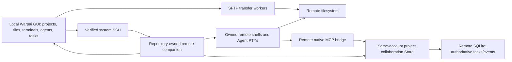

# SSH Remote Technical Plan

Date: 2026-10-03. Status: implementation design for the revised product; no SSH Remote acceptance is implied. Implements [PRODUCT.md](PRODUCT.md) SR01–SR41, sequenced by [PLAN.md](PLAN.md) R0–R7. The old technical plan is [archived](legacy-machine-collaboration/TECH.md). Source disposition is authoritative in [CUTOVER.md](CUTOVER.md).

## Context: actual reusable code and gaps

| Current source | Observed responsibility | Required decision/change |
| --- | --- | --- |
| `crates/remote_server/src/transport.rs:64` | Existing RemoteTransport abstraction, owned connection/client/event streams | Reuse rather than create another generic transport interface; check Windows ownership/multiplexing |
| `app/src/remote_server/ssh_transport.rs:28` | SshTransport over an existing ControlMaster path, binary discovery/install and protocol launch | Audit authenticated path; replace cloud/Oz installation; do not presume ControlMaster support on all Windows clients |
| `crates/remote_server/src/setup.rs:44` | RemoteOs currently Linux/MacOs, uname detection, channel-based Oz paths/download | Add Windows remote detection and independently packaged companion; inherited Linux detection is not release acceptance |
| `crates/remote_server/proto/remote_server.proto:9` | Little-endian length-prefixed protobuf envelopes; metadata/read/write/delete/run-command requests | Candidate control substrate; add bounded negotiated scope/ownership/receipts, do not treat current writes as conflict-safe |
| `crates/remote_server/src/client/mod.rs:199` | Initialize, directory metadata, file context, write/delete and command client | Reuse audited operations; make remote root/run and response identity explicit |
| `app/src/terminal/writeable_pty/remote_server_controller.rs:131` | SSH session bootstrapping and SshTransport connection | Audit endpoint setup versus ordinary shell lifecycle; preserve terminal core |
| `app/src/terminal/ssh/` | SSH detection/warpify/bootstrap helpers | Keep ordinary SSH; separate managed project admission from shell detection |
| `app/src/terminal/view/ssh_file_upload.rs:190` | Generates interactive SFTP upload commands | Reuse UI discovery ideas; shell/here-string command generation is not a structured transfer manager or cross-platform quoting proof |
| `app/src/code/file_tree/` | Existing file-tree/editor UI and snapshots | Audit remote-backed metadata/edit integration before adding a second Explorer |
| `crates/agent_bus/src/storage.rs:38` | Schema v6, transactional tasks/history, attempts/ledgers/reservations | Same engine on remote companion; preserve all upgrades and local history |
| `crates/agent_bus/src/mcp.rs` and `session.rs` | Schema-derived tools, per-launch native bindings/vendor adapters | Reuse remotely, taking remote executable/runtime/env as authority |
| `app/src/agent_communication/panel.rs` and `panel_controls.rs` | Existing task/operator GUI and async projection | Reuse on-demand task/message/history detail; migrate duplicate session navigation/control to sidebar, keep domain semantics |
| `app/src/workspace/view/vertical_tabs.rs` | Existing Tab/Pane CLI icons/status, navigation and row/context controls | Sole Agent/session management surface; extend remote identity/status/actions and exact task links |
| `app/src/terminal/view/use_agent_footer/mod.rs:752` | Current final peer-input check rejects remote sessions | Requires a verified remote managed-run route, not removal of this guard for every SSH tab |
| `crates/agent_bus/src/remote*.rs` | Enrolled-device/coordinator protocol, grants, actors, intents | Superseded product roles; see CUTOVER, do not wire them into new GUI as-is |
| `crates/warpui_extras/src/secure_storage/` | Existing platform secure provider; macOS error classification hardening | Keep common hardening; SSH keys remain system-managed, not copied into preferences |

R0 must verify reachable Lite paths and matching server implementation. The inspected remote_server crate supplies a client/protocol/installer; its existence does not prove a compatible independently maintained server binary is in this repository. Existing setup derives upstream Oz/cloud download URLs. That installer cannot be the new product's deployment path.

## Proposed changes

### 1. Ownership and authority

Local Warpai owns GUI state, SSH child connections, local input/drafts, transfers, selected project and read projections. A repository-owned remote companion owns admitted remote projects, remote process/run identity, scoped MCP endpoints and the authoritative collaboration Store. Remote vendor Agents execute in that project's canonical remote root. No remote Warpai desktop is required.

Use one single-writer collaboration Store per remote account/service, with existing isolated domain keys for each canonical project. This permits existing physical-checkout reservation checks across aliases/domains within that Store without exposing another project's records. A file-only SFTP connection needs no collaboration service. A separate user account is a separate authority; same path text never merges them.

The same local authority can manage multiple independent connections, but those connections do not federate tasks. GUI operator calls are authenticated by a verified SSH account/project attachment; Agent MCP uses narrower per-run capabilities. Neither endpoint accepts another caller's project/identity as authority merely because it appears in a payload.

### 2. Connection identity and SSH channels

Define RemoteConnectionProfile, RemoteEnvironment, RemoteProject, RemoteSession and RemoteRun in API.md. A local profile UUID is a user bookmark, not server identity. Resolve the authenticated account, server identity/host trust and remote canonical root during managed admission. Helper boot identity fences stale attachments after restart; durable project/service identity distinguishes reopening from replacement.

Separate:

- Interactive trust/authentication UI or terminal, with user-controlled prompts.
- Clean non-PTY machine-control streams, bounded negotiated frames and sanitized metadata diagnostics.
- Terminal streams/attachments with native input/output semantics, independent backpressure.
- SFTP workers with explicit original endpoint, root and transfer identity.

Reuse system OpenSSH alias/config/ProxyJump and ordinary SSH agent authentication. Do not read private-key contents, forward local MCP capabilities, automatically enable agent forwarding or execute profile text as a local shell command. Validate constructed argv and remote command boundaries: OpenSSH remote command arguments become a remote command string, so a local argv vector alone is not protection against remote shell interpretation. Use a fixed companion entrypoint and structured payload for roots/arguments; OS-specific bootstrap quoting must be tested.

Unknown-host verification is an explicit user action with a fingerprint; changed-host verification fails closed. Do not use StrictHostKeyChecking=no. Existing BatchMode relay restrictions apply to unattended machine channels after authentication, not to blocking all initial interactive SSH login. Existing blanket ClearAllForwardings restrictions must not disable a reviewed jump-host route.

If connection sharing is supported, own only app-created multiplexing resources. Do not stop a user-owned ControlMaster. If Windows OpenSSH cannot support the chosen multiplexing primitive, separate authenticated children remain valid; this is not a reason to use a Unix control-socket assumption on Windows.

### 3. Companion deployment and platforms

Keep remote_server manager/client/protocol where proven; implement the minimum missing server functionality in repository source. Evaluate extending the existing protobuf protocol first. Do not build another transport interface or launch a second collaboration daemon solely to preserve obsolete gateway classes.

Protocol reuse is a bounded R0/R2 decision: prove a source-built companion can implement the necessary initialize, scoped filesystem, session and collaboration calls through that client. If not, record the concrete missing primitive and choose one managed-control protocol before implementation. Existing JSON big-endian device frames and protobuf little-endian remote-server frames are incompatible; never auto-detect or mix them on one channel. API.md defines semantic requirements; wire version/encoding is pinned at this gate.

Deployment uses an explicit GUI action or documented manually installed path. Ship helper binaries from this repository's GitHub builds with source SHA, target triple, version, protocol features and checksums. Validate platform and executable provenance before activation. Upload to an owned private user directory, activate with atomic version selection where supported, preserve a previous compatible binary and clean only owned files. No Oz/cloud-account installer, sudo, global PATH/service/firewall changes or remote GUI package.

Local GUI: macOS and Windows. Remote helper: Linux/macOS/Windows. Initial target candidates are Linux x86_64/aarch64, macOS arm64/x86_64 and Windows x64, subject to executable build/runtime evidence; Windows ARM64 is not claimed without its own gate. Specify Linux libc/distribution baselines in R0 before choosing artifacts; do not imply one Linux binary supports every host. Detect Windows with a platform-appropriate probe rather than requiring uname. Every target needs a scoped shell/PTY implementation and SFTP prerequisite record.

Use a user-private account/service endpoint and single-instance lock; a second attachment reuses the same verified project service or returns a typed conflict. It cannot silently open a second writer. The service may outlive a transient SSH stream only under explicit managed-session lifecycle semantics. No persistent OS service is installed. Service boot changes clear readiness and require run reconciliation.

### 4. Remote paths and filesystem safety

Remote paths are typed with environment/project/root identity and remote platform spelling. The local client does not canonicalize them with the local std::path API. Helper calls resolve containment remotely, including symlinks, case sensitivity, Windows drives/UNC/junctions and Unix names. Workspace display strings remain separate from identity keys.

The helper validates project containment on each access and uses the selected authenticated root. Symlink replacement between validation and mutation must be handled with platform-relative handles/no-follow semantics where available, or fail closed/revalidate with an explicitly documented weaker capability. A canonical-string prefix check alone is insufficient for secure managed writes.

SFTP-only servers may lack a safe root-bound filesystem API. Negotiate realpath/stat capabilities, validate links on navigation/operation and label capabilities honestly. Do not claim a security sandbox against arbitrary remote races where the server cannot provide one; managed helper writes carry the stronger contract, while bare SFTP access remains the user's SSH account authority and reviewed destination. Unsupported encodings/names are visible, never silently rewritten.

Read metadata/list pages lazily and bound content in memory. Reuse file tree/editor models with a remote location handle. Root/name strings and fetched content never become local executable paths. Preserve remote location in editor buffers/evidence references across project changes.

### 5. SFTP transfer and edit behavior

Use SFTP over SSH only. No FTP/FTPS library, profile or fallback. First audit installed/system SFTP and existing upload code. A command-line SFTP worker is acceptable only with reliable structured paths/status, bounded cancellation, binary streams and tested escaping. Do not parse ls/progress output as authoritative metadata or assume the current here-string upload syntax works on Windows.

If system SFTP cannot meet the queue/status/encoding contract, document the specific gap before choosing a focused SFTP implementation/dependency. Do not implement SSH cryptography or another file-sync service. File listing/edit metadata may use the scoped companion while byte transfers use SFTP; both must bind to the same verified environment/root.

Transfer rows retain original local/remote endpoints, source fingerprint, destination policy, progress, result and owned partial path. Bound concurrent workers/queues and terminal buffers. No recursive silent sync; recursively enumerate only user-selected batch sources. Define symlink treatment explicitly, reject cycles/root escapes and revalidate source changes before continuing.

Use a unique temporary sibling file, stream bytes, verify completion, then rename on the server when its capability permits. Negotiate atomic overwrite rather than infer it. A interrupted rename with no receipt is commit_unknown, not failed/complete; inspect original destination/temporary identity before a retry. Reconnection or app restart never blindly overwrites a changed destination.

Text saves use an opaque original file fingerprint: Prefer remote content hash/version from the helper; size/mtime alone is insufficient where the server has coarse timestamps. The helper checks and replaces under one owned file-operation boundary where possible. External noncooperating writers cannot be fully serialized by advisory reservations; document remaining server capability rather than invent an OS lock guarantee. File-only SFTP conflict detection may require a bounded reread/hash before overwrite. Large-file streaming/compare limits are explicit.

Only safe resumable transfers advertise pause/resume. Otherwise show cancel/retry with a fresh owned partial file. Cleanup owns its temporary paths, not arbitrary suffix-matching files. Download finalization similarly uses a local temporary file and explicit overwrite policy.

### 6. Remote PTY and process lifecycle

Prefer existing terminal renderer/writeable-PTY/SSH bootstrap abstractions. Ordinary SSH tabs remain ordinary. Managed remote session admission adds a proven remote session/run/attachment identity; do not enable Agent functionality by detecting the word ssh in shell output.

For managed Agent sessions, the companion must expose trustworthy remote process ownership, PTY input/resize/stop and native lifecycle binding. Reuse the existing remote terminal server if its source/capabilities satisfy these requirements; otherwise add only the required scoped PTY/session functions to the chosen companion. A buffered RunCommand RPC is not an interactive terminal.

The remote service associates run IDs with owned process handles and boot identity, not only numeric PID. GUI callbacks carry connection/project/session/run/attachment generations. Input and interrupt recheck all of them; a replacement process cannot receive an old frame. Stop is a request; only observed exit or explicit authoritative outcome establishes stopped. Never kill unrelated users' processes or broad process groups.

Close view, detach, disconnect, stop run and remove profile are different controller operations. For accepted managed sessions, closing a view or losing the SSH attachment detaches the view and keeps the owned remote process/PTY alive until explicit Stop or observed exit; no disconnect timer silently kills active work. Reattach reconciles the exact service/run and uses bounded output replay with an explicit truncation marker when the buffer limit was exceeded. Once no sessions/requests remain, the owned helper may exit after a fixed idle grace period; it never installs an OS autostart service. Project removal reviews retained active sessions and offers Stop or Leave running explicitly. Raw SSH terminals without helper ownership cannot claim these retention guarantees and show their limitation before abandoning active work. Network loss alone does not prove the OS process ended.

### 7. Remote Agent MCP and guarded wake

Discover remote executable paths/help/version under the selected remote account/root. Use existing native vendor adapters with remote execution functions. Do not run the local discovery list against a remote root, copy personal MCP configuration or share a local Codex daemon with remote runs. Reversible managed setup changes only Warpai-owned remote configuration; inline per-launch bindings are preferred.

Remote MCP connects to the remote private collaboration endpoint. Fresh per-run capability resolves current remote actor/root/run; do not forward originating local WARP_AGENT_CAPABILITY/endpoint/VIBE_MCP_SERVERS. Agent tools still cannot select operator identity, trust policy or execution scope. Reuse the existing Store, generated tool schemas, task attempts and request ledger.

Keep remote readiness in the verified remote run owner; local GUI caches it with source/age. A heartbeat proves connectivity only. Native approval/input/lifecycle uncertainty fails closed. The GUI's local draft is independently protected. Managed prompt submission requires both local attachment/input safety and companion-confirmed remote readiness/input/approval safety; check immediately before bytes and delayed Enter. Reject all stale connection/run/draft generations. Unsupported adapters keep manual terminal use and messaging but cannot advertise automatic wake.

The existing guard rejecting remote peer prompts remains until a separate managed-remote admission passes those checks. Do not remove it globally. Durable delivery observations record claimed/submitted/cancelled with metadata and no execution/acknowledgement inference.

### 8. Tasks, evidence, reservations and GUI projections

Use the existing vertical Tab/Pane sidebar as the sole session/Agent UI. Reuse its CLI icon/status and pane/view lookup rather than introduce a second roster/controller registry. Bind each sidebar row to its actual project/session/run; aggregate multiple panes at tab level without pretending one tab equals one Agent. Retained detached managed sessions appear in that project's same sidebar hierarchy with an attach action and no duplicate attached/detached entry.

The collaboration panel owns task/message/history detail only. It is closed by default on fresh profiles; preserve persisted existing selection. Do not open/focus it from background events. Its default task view is compact; attempts/dependencies/history maintenance and risk overrides are progressive disclosure, with the existing backend safeguards unchanged. Remove independent Agent roster/session control UI after sidebar equivalence is verified; retain participant attribution/assignee pickers and a Navigate to owning session link where needed.

Use existing session/runtime models plus scoped task projections as the shared source for sidebar badges and task details. Backend SessionList/AgentList and lifecycle identity remain necessary; retiring a duplicate GUI does not delete those APIs or durable records. Navigation resolves project/actor/run to the current exact pane/attachment; retired/missing runs show unavailable. A sidebar task link opens the task view explicitly; a task session link focuses only the matching terminal on explicit action. TaskCancel is a domain stop request, while sidebar SessionStop targets a process; neither operation automatically claims the other succeeded.

Authoritative remote transitions use the same Store::execute/state machine as local transitions. Remote operator actions are project-scoped and attributed to the verified GUI operator; ordinary Agent MCP stays narrower. Preserve expected_version, revision, attempt, run epoch and stable request identity. Do not create a second task engine on the local GUI.

Reuse local panel paging (50-record pages, bounded event tail), task forms and stale-callback guards with an authority handle. Every task/form/query is pinned to its original location/scope. A remote snapshot is a read projection; offline disables new mutation submission. Retain a bounded original-intent spool for requests already submitted or explicitly staged while connected; no automatic offline task assignment.

Reconnect fences old control attachments before absent-receipt answers, checks retained original receipts and current run/authorization, then resumes events from confirmed cursor/high-water snapshot. Never replay an arbitrary user command because its response was lost. Lost launches, filesystem writes and task transitions each have their own original receipt/fingerprint boundary, not one generic retry flag.

Remote reservations validate actual remote paths in the same Store that manages the physical remote checkout. No participant-local/private versus remote-coordinator two-database reservation scheme is needed. Different project scopes stay private, while roots referring to one physical checkout are resolved consistently. GUI file writes show conflicts but do not promise to enforce reservations against external writers.

Evidence records remote project/checkout/run/attempt and reported command/outcome. Explicit file opening uses original producing location over authenticated remote access; local files are not substitutes. Remote independently computed hashes may establish verification, distinct from an Agent-reported hash or the current edited contents. Offline evidence is metadata only until fetch succeeds.

### 9. Storage and obsolete-feature removal

Follow CUTOVER D01–D16. Keep schema v6 compatible while old tables become non-operational; do not decrement user_version or remove earlier migration/backup fixtures. Add environment/project/profile/intent fields with a new schema migration only after inspecting real foreign references and current row usage.

Old device invitations/grants, remote native bindings and pending rows are not automatically adopted as remote projects. Preserve legacy tasks/messages/attempts/evidence and unresolved intents in read-only/exportable form. Epoch expiry or feature removal cannot make them execute under a new identity. Auth verifier tables and secure device keys have explicit cleanup ownership; a failed cleanup remains visible without re-enabling credentials.

Remove obsolete active endpoints, app enrollment polling and invitation/device controller operations after compatibility fencing, then simplify internal APIs/tests. Retain shared secure storage error handling, pipe/socket permissions, authorization-before-replay, transaction atomicity and draft-safe delivery protections. Do not uninstall user SSH config, vendors, terminal code or unrelated upstream platform code.

## Testing and validation

V01–V24 in [ACCEPTANCE.md](ACCEPTANCE.md) are the new current gates. Historical C01–C14/M0–M7 evidence stays linked but cannot satisfy remote-process/file/session gates. Each package has a minimal executable check and meaningful failure case; do not replace remote runtime tests with serialization snapshots.

- R0: reachable-entrypoint inspection, legacy profile/table/unknown-intent migrations and local regression suites.
- R1/R2: actual controlled OpenSSH service, verified/changed/unknown host, authentication cancellation, independent SFTP/helper capability and companion checksum/platform/version negotiation.
- R3: byte-for-byte upload/download, conflict-safe save, symlink/name/case/escape checks, partial/disconnect/cancel/resume and denied permissions; large directory/file memory bounds.
- R4: actual remote PTY shell/Agent processes, cwd marker and remote-only filesystem changes, resize/Unicode/input/interrupt, delayed stale input and reattach ownership.
- R5: two deterministic remote Agents through actual UI, tiny source edit/test, result/rework/accept; assertions that the local same-named file is unchanged and remote run IDs are distinct. Separate paid/vendor execution gate.
- R6: static then live screenshot review of existing sidebar status/context actions and on-demand task/message detail at narrow/wide/theme/text-scale states. Cover multiple panes, detached sessions, exact cross-links, closed-panel background updates, keyboard/focus/accessibility and rapid project switch with late responses.
- R7: fault injection and eight-hour end-to-end soak, complete source/packages/provenance and no old endpoint/dependency reachability.

Rust builds/tests run on GitHub. Build local macOS/Windows desktop/default/warp_platform and approved Linux/macOS/Windows remote helpers separately. Controlled Linux remote fixtures are allowed by the user's scope correction; this does not add Linux desktop CI. Remote macOS/Windows physical and vendor-model rows require actual environments and budget. Log whitelisted test metadata and owned screenshot steps, never raw authentication output, environment values, credentials or arbitrary terminal transcripts.

## Risks and concrete mitigation

| Risk | Required mitigation/gate |
| --- | --- |
| Upstream remote client expects an external Oz implementation | Verify source/artifact availability in R0; deploy only repository-owned compatible helper |
| Unix-only ControlMaster/uname/PTY assumptions | Explicit local/remote OS adapters and runtime matrix; no Linux desktop expansion |
| SFTP escaping and human-output parsing | Structured metadata/byte/status contract, malicious-name fixtures and argv/remote-shell boundary tests |
| Lost launch/save/task reply | Separate durable original receipts, reconciliation and no blind command replay |
| Remote root/file race | Server-side containment/handle safety and honest bare-SFTP capability limits |
| Approval/draft hidden by disconnect | Remote lifecycle proof plus local draft/attachment guards; unknown disables wake |
| Two project-service writers | Account-service ownership lock/attach proof and duplicate-start test |
| Legacy rows become executable under a new model | No automatic adoption, read-only preservation, schema/epoch compatibility fence |

## Primary references

[OpenSSH ssh manual](https://man.openbsd.org/ssh) defines remote command and authentication/forwarding behavior. [OpenSSH sftp manual](https://man.openbsd.org/sftp) defines the SSH-based transfer client and batch/resume options. Use these alongside pinned implementation code; neither document proves current repository functionality. SFTP is the only planned transfer protocol.

## Host status projection (SR41)

The SSH task panel's status header reads bounded remote host observations from
its exact environment/project attachment. Reuse the companion's control channel
and GUI generation fence; no separate metrics transport/daemon or central
telemetry is needed. OS-native counters supply optional CPU/memory/uptime; volume
space refers to the selected remote root. Missing, stale and disconnected data
remain distinct. See [HOST-STATUS.md](HOST-STATUS.md). Implementation and static/
live host-status acceptance remain pending.

### Executable protocol extraction decision

R0/R2 uses `remote_protocol` for the existing protobuf schema and little-endian
codec. `remote_server::{proto, protocol}` remain re-exports so current desktop
consumers keep the same API. The light crate may be used on Linux without WarpUI;
this does not enable Linux desktop builds. Managed channels use its explicit
bounded read/write functions with a 1 MiB limit; ordinary inherited calls retain
their existing limit. The companion implements versioned managed operations on
that envelope and refuses inherited unrestricted file/command operations.

### Native SFTP read foundation

Use system OpenSSH's `sftp` subsystem as its own standards-defined channel;
protobuf remains the companion control wire. Implement one bounded SFTP v3
reader for structured realpath/lstat/directory/read responses, using the
[SSH file transfer v3 specification](https://www.ietf.org/archive/id/draft-ietf-secsh-filexfer-02.txt).
Do not parse human-readable ls output or place filenames in shell/batch syntax.
Requests are serial, correlated and timed; packet allocation is capped at 1 MiB,
file reads at 16 MiB and directory snapshots at 2000 entries with explicit
truncation. Canonical roots and paths are resolved by the SFTP server and checked
with protocol path spelling. File-only connections need no companion path.
Initial source supports reads only; root confinement is not a kernel filesystem
jail against another process of the same SSH account. Symlink escapes are
rejected and mutation/editor integration waits for the reviewed write boundary.
Native Windows SFTP-root mapping and other target runtime checks remain pending.
