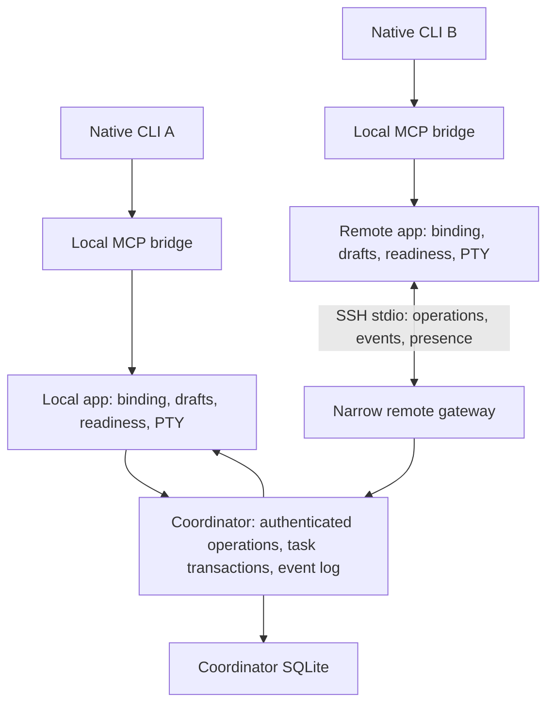

# Agent Collaboration Technical Plan

Status: proposed, 2026-10-01. Implements [PRODUCT.md](PRODUCT.md); sequencing is in [PLAN.md](PLAN.md), and wire/tool contracts are in [API.md](API.md). All new modules, schemas, constants and commands below are proposals until their work package is implemented and verified.

## Context

Baseline source is `7d2eac7`. The existing system already has authenticated local IPC, native MCP discovery, a transactional task state machine, revision checks, idempotency and guarded terminal wake. The next implementation must preserve those guarantees while adding observable control and cross-device routing.

| Current location | Responsibility and planned change |
| --- | --- |
| `crates/agent_bus/src/lib.rs:19` | Canonical local project root; keep local path validation, introduce explicit space/workspace IDs above it |
| `crates/agent_bus/src/lib.rs:34` | Serde `Operation` contract; add the operations in API.md |
| `crates/agent_bus/src/lib.rs:104` | Message/task records; add threads, versions, attempts and evidence references |
| `crates/agent_bus/src/lib.rs:163` | SQLite snapshot load/commit; migrate to indexed rows and transactions |
| `crates/agent_bus/src/transport.rs:105` | App-owned local broker; retain Unix sockets/Windows named pipes and private filesystem permissions |
| `crates/agent_bus/src/transport.rs:279` | Prepare/activate local terminal capability; remain a local controller operation |
| `crates/agent_bus/src/transport.rs:392` | Wake eligibility and claims; retain final local authority over PTY submission |
| `crates/agent_bus/src/mcp.rs:199` | Tool schemas derived from serde; extend the shared source of truth |
| `crates/agent_bus/src/session.rs` | Per-launch binding, Codex daemon isolation and native overrides; preserve existing adapters |
| `app/src/agent_communication.rs` | Settings, live views, polling and notifications; add read projections, operator actions and remote connection ownership |
| `app/src/agent_communication/setup.rs` | Reversible vendor setup; add version/health reporting without replacing native configuration formats |
| `app/src/workspace/view/left_panel.rs:99` and `app/src/app_state.rs:316` | Existing panel selection and persistence; add native collaboration view |
| `crates/warpui_extras/src/secure_storage/mod.rs` | Existing platform secret storage; reuse it for device credentials without cloud auth dependencies |
| `crates/agent_bus/tests/coordination.rs` | Existing real IPC/MCP and simulated-identity tests; extend semantic coverage |
| `.github/workflows/validate-agent-communication.yml` | GitHub-only Rust tests/checks and review artifacts; extend rather than add a separate build system |

The six-client native handshake record is not real-model execution acceptance. M0 must also check the previous workflow's final application/package result rather than inferring it from successful protocol tests. Current text fields are bounded at 8192 bytes, frames at 1 MiB, and several snapshot collections at 1000 records.

## Proposed changes

### 1. Ownership and module boundaries

Retain `warp-agent-bus` as the single domain implementation. Add `storage.rs` for migrations/indexed queries when replacing the snapshot, `remote.rs` for the SSH session protocol, and `app/src/agent_communication/view.rs` for the panel. Keep small domain transitions alongside `Operation` initially; split only when a cohesive module actually exists. Do not introduce a generic transport framework, repository abstraction, event-sourcing platform or external queue service.

Separate authenticated caller context from business arguments. Local MCP authentication resolves a terminal/run to an actor. The trusted local UI resolves to a human operator actor. A remote channel resolves to an enrolled device and its registered actors. All paths then call the same transaction/state-transition functions. Agent tools cannot submit actor identity, device grants or arbitrary terminal control commands as trusted fields.

For each collaboration space, exactly one app-owned coordinator writes authoritative tasks/messages. The host's local agents use that same coordinator through local IPC. A remote participant owns its local terminal controller, a bounded outgoing operation spool and a read cache, but not a second writable task database for that shared space. Private spaces remain locally authoritative and continue working during remote outages.

The remote gateway and the coordinator app run on the same host. If the app is unavailable, the gateway reports `coordinator_unavailable` and exits; it does not silently start a daemon. No model provider SDK or account runtime is added.

### 2. Durable state and migration

Use the existing SQLite/Diesel dependency and a versioned schema. Maintain one write owner and short transactions. Busy retries are bounded; avoid holding the broker state mutex during file IO, SSH IO or expensive search.

| Proposed table | Essential data/indexes |
| --- | --- |
| `spaces`, `workspaces` | Space/coordinator ID, device-local checkout mapping, repository ID, scope policy |
| `agents` | Stable identity, device/space/workspace ownership, display metadata; unique qualified name per space |
| `tasks`, `attempts` | State, revision, row version, issuer/assignee/reviewer, deadlines; attempts carry owner run/epoch and outcome |
| `task_dependencies` | Directed prerequisite edges; unique pair and reverse lookup index |
| `threads`, `messages` | Subject, sender/recipient, reply/task linkage, acknowledgement; ordered sequence and scope indexes |
| `events` | Space sequence, event ID, resource/attempt IDs, actor, observed timestamp, bounded payload |
| `reservations` | Workspace/checkout, normalized relative path/subtree, owner attempt, mode and expiry |
| `evidence` | Task/attempt, type, producing workspace/commit, bounded reference metadata and verification provenance |
| `mutation_epochs`, `idempotency` | Expiry, actor/epoch/request ID, request fingerprint and committed response |
| `device_grants` | Enrollment ID, allowed spaces/roles, credential verifier and revocation generation; no raw bearer secret |

Participant spools/cursors use a separate local database/namespace; they must not share the coordinator's authoritative tables. Live terminal capabilities, readiness leases and raw device secrets remain outside durable domain rows. Existing Windows secure storage uses encrypted files through the platform wrapper; do not assume it is the Windows Credential Manager.

Migration sequence:

1. Acquire exclusive application database ownership; close old communication sessions and verify free space for a backup. Make a private backup using SQLite's consistent backup facilities or a closed-file copy, never a live main-file-only copy with an active WAL.
2. Validate the v1 snapshot and import identities, task IDs, revisions, messages, acknowledgement flags, feedback and idempotency records in one migration transaction. Preserve original ordering. Historical timestamps not present in v1 stay unknown; migration time is not presented as execution time.
3. Map each canonical project to a private space. Mark old running tasks interrupted and clear live execution authority. Import old retries only into a legacy, non-writable request epoch: former terminal capabilities are already invalidated.
4. Check row counts, references and representative state hashes, then commit the schema version and a downgrade guard. The current v1 loader ignores `user_version`, so that field alone is insufficient. Preserve the original snapshot in the backup and replace the writable legacy payload with an explicit incompatible-schema sentinel that the known v1 deserializer rejects. Test this with the released/previous bridge; do not ship the migration if an older writer can silently resume.
5. Crash before commit leaves v1 usable; crash after commit reopens v2. Failed validation preserves the backup and prevents mutation. Normalized storage is not dual-written back to v1.

Rollback after new work exists requires exporting v2 history and explicitly restoring the pre-upgrade backup. Feature disablement only revokes participation and is not a database rollback. Test restore on both platforms and retain a clear schema/app compatibility record.

Backup files are version-specific: the original v1 snapshot remains in
`<database>.pre-upgrade`; a normalized v2→v3 upgrade writes
`<database>.pre-upgrade-v2`. Never overwrite the original backup to make a later
upgrade proceed. Select the matching schema backup deliberately when restoring.

### 3. Events, delivery and diagnostics

Commit task/message mutation and its domain event in the same SQLite transaction. Use coordinator-assigned per-space sequences, stable event UUIDs and resource IDs. Transient UI states such as typing are read-model updates; persist meaningful delivery transitions and errors, not every terminal byte or poll.

A delivery record distinguishes broker queue admission, local controller claim, PTY submission, MCP acknowledgement and TaskStart. Model output is not parsed as authoritative task completion. If the model never acknowledges, expose a stalled delivery with a guarded user retry action; do not repeatedly paste on a timer. A retry reuses the pending message and checks current run/input state. The existing protected-input and delayed-Enter checks remain the final gate. Extend target resolution to known authorized offline identities for queue admission, while retaining live-run requirements for claim/start/submit. Revoked identities cannot receive new work.

Read APIs are cursor-paginated (default 50, maximum 200). Panel subscriptions request events after a cursor; after event compaction, `cursor_expired` requires a fresh scoped snapshot plus its high-water sequence, then events after that sequence. Apply each event at most once to the read projection. This is a diagnostic/event projection, not a second domain state machine.

Diagnostics include app/bridge/CLI version, OS, adapter, lifecycle source, connection state and stable reason codes. Do not capture arbitrary environment values, credentials, shell history, prompts or full terminal output. Redact sensitive-looking values in diagnostic error text; explicitly shared message bodies/evidence follow their space's access policy.

### 4. Task state, attempts and cancellation

Use API.md as the transition authority. Distinguish task revision (review/rework generation), row version (optimistic concurrency) and attempt ID (one execution owner). Retry/reassignment increments revision and starts a new attempt; an old run/revision/attempt can never submit into it. Preserve prior results and evidence in attempt history.

Cancellation of queued/blocked/submitted work is immediate. Cancellation of running work creates `cancel_requested`, revokes future continuation/start permissions and sends a high-priority control notification. The receiver controller may invoke a verified native cancellation action only for the current owning run and only when that action cannot answer an approval prompt or affect unrelated foreground work. Otherwise show `Stop required` and keep cancellation pending. Native idle alone does not prove task cancellation: require an explicit cancelled outcome from the assignee or observed process exit.

The coordinator cannot undo external side effects or ensure an unreachable process stopped. A lost connection changes execution certainty to `unknown`; it does not automatically fail, cancel or reassign the task. A human override records the acknowledged risk, fences old submissions and leaves the old attempt in history. Recovery in a replacement pane requires a verified native binding, explicit reclaim of the stable agent identity, and known termination of the prior process or an operator override; a name match or expired network lease is insufficient. Never kill a broad process group.

Deadlines are optional. Coordinator UTC timestamps define start/review deadlines; monotonic time drives live heartbeat/lease intervals. A start deadline can expire unstarted work. An execution deadline requests cancellation. An overdue review remains submitted and raises a visible reminder. Clock jumps must not create duplicate starts or silently transfer ownership; inject clocks in tests. The durable deadline sweep accepts an explicit observed UTC value internally; production supplies the current clock, while regressions move that value backward and forward without changing the system clock. Event timestamps remain real observations.

### 5. Dependency and claim scheduling

Keep all dependency checks and claim/start transitions within the write transaction. Reject cycles and cross-space references on edge changes; start/claim checks prerequisites again. Initially use a bounded depth-first cycle check rather than a new graph dependency. A task cannot edit its prerequisites after execution starts.

Accepted prerequisites unlock dependents. Failed/cancelled/expired prerequisites leave dependents blocked with the exact prerequisite IDs. Retrying a prerequisite does not retroactively invalidate accepted downstream work; editing completed graphs requires a new task/revision, not rewriting history.

An unassigned task has a nonempty explicit eligible-agent list and a reviewer. Claim checks eligibility, native presence, no other running delegated task, prerequisites and row version, then assigns exactly one actor. FIFO determines candidate order. Wake one eligible ready candidate with a task-available notification; a failed/expired delivery may select another, but the claim transaction remains the only ownership decision. Do not add automatic model scoring, vendor-specific skill inference or autonomous spawning.

### 6. File/worktree coordination

Maintain three distinct identities: collaboration space, logical repository and device-local checkout. Canonical local paths map to a checkout ID on the machine that owns that filesystem. A coordinator must not run `canonicalize` on a remote Windows/macOS path or infer authorization from a Git remote URL.

Initially support an exact file or directory subtree, not arbitrary glob expressions. Normalize separators for the logical representation, reject absolute paths/parent traversal/device path prefixes, and evaluate local path aliases/symlinks/case behavior with the owning machine's filesystem. Resolve non-existing targets through their nearest existing parent. Escape from the mapped root is rejected.

Shared reservations may coexist. Any overlapping exclusive reservation in the same checkout conflicts and is rejected with owner/task/expiry details. Different checkouts of the same logical repository receive merge-overlap warnings, not false physical locks. Reservations use coordinator time, default ten minutes, renewable while the owning attempt remains valid. Expiry/revocation releases a coordination lease but leaves an abandoned-owner warning if execution is unknown. Agents retain their ordinary OS write permissions; the UI must never call reservations an enforced filesystem sandbox.

The local implementation uses an explicitly supplied opaque repository UUID on
workspace mappings. A lease snapshots space/repository/workspace at creation;
legacy and private leases remain unshared. Warning reads require both current
memberships and matching mappings, return at most 50 metadata rows with a
truncation flag, and never expose another checkout's absolute path. SQLite v4
adds nullable identities transactionally and preserves a `.pre-upgrade-v3`
backup. Defaulting to no grouping avoids inferring membership from Git remotes.

### 7. Threads, evidence, search and retention

Keep message bodies and existing text fields at 8192 bytes initially; use paginated threads and references for larger work. Each reply preserves a thread and optional task link; visibility is checked before resolving parent references. Index scope, sequence, task, sender and subject. Use SQLite FTS5 if the pinned bundled build supports it on both targets; otherwise ship bounded indexed filtering and label full-text search unavailable until the build capability is verified.

Evidence is metadata: relative file/diff path, commit/object ID, test command label, outcome, producing checkout and attempt. File resolution is local and contained beneath the mapped workspace. External links are displayed and opened only through normal user actions. Never execute received evidence or fetch a remote filesystem path automatically. Hash/commit checks may mark content locally verified; an agent's reported `passed` status alone remains reported evidence.

Archive terminal, unreferenced work after 30 days by default; archiving changes visibility, not ownership or stored content. Keep failed/expired tasks with unresolved dependents and all uncertain execution active. No automatic permanent deletion. An export/purge operation previews counts and affected references and cannot delete active work, unread messages or required retry records.

Replace the global lifetime 1000-record ceiling with bounded active work plus disk/retention controls. Initial defaults: 1000 active tasks per space, 1000 unacknowledged messages per agent, 1 GiB soft warning/2 GiB configured hard database budget, and bounded connections/frames. Preserve a small control-record budget for acknowledgements/cancellation/cleanup near the configured quota. Real filesystem exhaustion can still prevent durable writes; report that explicitly and retain local terminal stop controls. Do not promise that cancellation was durably recorded when its transaction failed.

At-most-once mutation handling applies within a server-issued mutation epoch (initial maximum seven days). Retain deduplication rows through epoch expiry plus a one-day cleanup margin. Authenticate/reject expired epochs before checking whether a request ID exists; cleanup must never make an expired request eligible again. A client persists the original epoch/request ID with its pending operation and must reconcile an unknown result instead of silently resending it under a new epoch.

### 8. Native UI implementation

Add a collaboration variant to `ToolPanelView`, the persisted `LeftPanelDisplayedTab` conversion and workspace action routing. Use a dedicated native view with Agents/Tasks/Activity sections and a detail view. Reuse existing list, text, focus, action button and theme primitives. Add device configuration inside the existing communication settings rather than a separate application shell.

The static fixture is the visual source of truth before live integration: idle/busy/protected/offline agents; queued/blocked/running/cancelling/submitted tasks; long content; permission errors; empty/loading states; remote disconnect and storage pressure. Keep keyboard selection stable across updates, restore focus on close, and do not move terminal focus after background activity. Use existing English UI text conventions and accessible labels.

Subscribe at the app model level and update visible rows incrementally. Storage/SSH/health probes run off the UI thread. Debounce search and cancel stale read requests; a slow response from a previous space must never populate the current space. Use existing view ownership/weak handles for terminal focus and delayed actions.

### 9. SSH transport and trust

Use the system OpenSSH executable as a child process with `-T` and a fixed `warp-agent remote-stdio` command on the selected SSH host. Standard streams carry the bounded length-prefixed JSON protocol; stderr contains bounded diagnostics. Host aliases are validated as data and may not introduce command-line options. No user task text, paths, tokens or commands are interpolated into the remote command. The host prerequisite is a verified companion command on the SSH session PATH; fail with setup guidance if absent. Test macOS shells and Windows OpenSSH's configured default shell rather than assuming Unix quoting.

Reuse established SSH authentication and known-host verification. A setup connection may require the user's ordinary SSH authentication/host verification; reconnect uses noninteractive authentication and fails visibly if it needs user input. Never bypass changed host keys, enable agent forwarding or modify SSH/firewall/service settings automatically. Existing user-configured jump hosts may be used, but Warpai does not implement NAT traversal.

SSH authenticates access to the host account. Application enrollment additionally binds a stable device ID to explicit space grants. The host app creates a random 256-bit, single-use invitation valid for five minutes; the participant supplies it over the already authenticated SSH channel. The host returns a distinct device credential, stored only through platform secure storage, and stores a one-way verifier. Neither invitation nor credential is placed in argv, configuration, MCP tool arguments, logs or repository files. The app supplies the connection handshake in memory; use workspace `rand`/OS randomness for generation and `sha2` for high-entropy credential verifiers. Promote the already locked `subtle` 2.6.1 dependency to a direct dependency only for constant-time verifier comparison; do not implement a custom cryptographic primitive. Verify generation, comparison and revocation in the security tests.

The gateway connects to a separately authenticated local controller endpoint. The app publishes a private runtime descriptor containing its endpoint/PID/protocol version, with local per-user permissions, and validates the gateway/enrolled principal before admitting operations. The existing per-terminal MCP endpoint must not gain public prepare/activate/grant APIs. Same-OS-user compromise remains the existing trust boundary; a remote enrolled device is restricted to its own identities and granted spaces.

Enrollment, grant changes, workspace mapping and revocation are operator actions, never agent tools. Closing/disabling a connection increments its revocation generation and invalidates sessions. A device may announce only its own mapped native agents; the local controller remains responsible for authenticating native MCP sessions. Coordinator validation never accepts sender/device identity from a free-form task field.

### 10. Remote sessions and reconciliation

One authenticated bidirectional channel per participant/coordinator carries hello, presence, operations, results and event batches. Reuse the existing frame bound; cap concurrent in-flight operations and connection buffers. Do not open the broker's Unix socket or named pipe directly to the network. Gateway connections are app-owned and bounded.

Proposed initial constants: five-second heartbeat, twenty-second presence expiry, exponential reconnect delay from one to thirty seconds with jitter, maximum 32 in-flight mutations per connection, one MiB frame bound and 200 events per page. Presence expiry prevents new claims/wakes; it does not authorize reassignment of unknown running work. A fresh connection gets a new session epoch and re-announces currently live local runs.

Every mutation is acknowledged only after the coordinator commits it. A participant may persist bounded pending requests and completions locally, but an offline mutation is labeled `pending connection`, never `committed`. TaskStart/claim must receive a committed grant before execution begins. Existing running native models can continue while offline; the controller stops automatic subsequent work and spools reported outcomes. Exactly-once model/file/network side effects are outside the transport guarantee.

After reconnect, authenticate and negotiate versions, retrieve a snapshot/event cursor, query unconfirmed request IDs within their original epoch, and reconcile each live attempt with coordinator state. Replay unchanged eligible requests only. A cancellation/revocation/newer attempt causes stale completions to be retained as diagnostic evidence rather than applied. A restarted coordinator invalidates old execution grants and requires explicit recovery; it does not create two writable authorities.

Remote wake is an authenticated notification naming an existing agent/run/message. The receiving app repeats all native readiness, draft, permission and delayed-Enter checks immediately before submitting. The coordinator cannot inject arbitrary PTY bytes, answer permission prompts, launch shell commands or directly manipulate a remote terminal.

### 11. Compatibility and rollout

The public native MCP session remains stdio and uses the pinned SDK's supported handshake. The SSH channel is a separate internal protocol with explicit major/minor/features. Preserve the Codex loopback exclusion, Antigravity discovery prelude, Cursor runtime environment references and distinct QoderCN identity.

Keep current tool names and required parameters; add optional fields and additional tools. New controller operations require negotiated support. An older companion that cannot represent new states/versions is rejected with a restart/upgrade message; do not silently flatten cancelled/unknown work into queued/running. A new native CLI client need only understand standard MCP tools; it need not implement the internal SSH protocol.

Ship local layers first under the existing opt-in. Remote collaboration is independently disabled by default until M6/M7 gates pass. No feature should activate an excluded cloud login, telemetry or platform MCP runtime. Keep default and `warp_platform` compiling, and package the same companion source as the app.

## Testing and validation

### Acceptance matrix

| ID | Product invariants | Required verification and pass condition |
| --- | --- | --- |
| C01 | B01, B07–B09, B30 | Each installed eligible CLI acts as issuer and receiver with a known-good counterpart: native discovery, real fixture edit/test, submission, one rework and acceptance. Record exact versions and task evidence; simulations cannot satisfy this row. |
| C02 | B02, B07–B08, B12 | Real UI busy/draft/approval/pause/replacement cases plus deterministic PTY tests: no injected Enter in protected state, no duplicate start after delayed delivery, no stale-run success. |
| C03 | B09–B12, B29 | Migrate valid/full/interrupted v1 fixtures, inject crash/disk-full at migration boundaries, compare IDs/revisions/ACKs; old binary must reject the upgraded writable DB and backup restore must reproduce original data. |
| C04 | B07, B12, B26 | Drop responses after commit, repeat identical/different-payload request IDs, expire/prune epochs and restart: one durable transition, conflicts rejected, expired requests never re-execute. |
| C05 | B02–B06 | Native static/live UI screenshots on macOS/Windows; narrow/wide, light/dark, keyboard, accessibility, long text and stale responses. No clipping, focus theft or wrong-space data. |
| C06 | B09–B12, B15 | Start/cancel/submit/retry races, native interrupt supported/unsupported, offline worker and deadline/clock jumps; no false stopped status or reassignment without proof/explicit override. |
| C07 | B13–B15 | Cycles, failed prerequisites, 20 concurrent claims, busy/offline candidates and rework: one owner, only accepted prerequisites unlock work, FIFO among eligible tasks. |
| C08 | B16–B17, B23 | Same-file/subtree overlap, separate worktrees, symlink escape, case aliases, non-existing files, Windows prefixes and lease expiry; scope preserved and advisory limits visible. |
| C09 | B18–B20 | Thread/reply visibility, forged task reference, missing artifact, path traversal and agent-reported vs verified tests; no implicit file upload, execution or cross-space disclosure. |
| C10 | B21, B29 | 100k archived messages and 10k completed tasks; paginate/search/archive/export/purge and inject quota/full disk. No loss of active/uncertain work or live retry protection. |
| C11 | B22–B24, B27 | Real SSH on each host OS: unknown/changed host key, bad auth, expired/reused invite, wrong device/grant, revoked credential, unavailable secure store, malformed/oversized frames; fail closed and redact diagnostics. |
| C12 | B25–B26 | Fault-injected duplicate/dropped/out-of-order events, disconnect after commit, host restart and participant sleep; reconcile requests/cursors/attempts without duplicate ownership or silent success. |
| C13 | B22–B28, B30 | Physical macOS host + Windows participant and Windows host + macOS participant; remote real-model task, progress, stop/retry and rework/accept. Use exact RC artifacts; same-machine sockets do not satisfy this row. |
| C14 | B01–B30 | Both OS protocol suites, app default/platform checks, focused app tests, review package/signing checks and eight-hour deterministic soak; preserve terminal/core exclusions and clean shutdown. |

M0 uses disposable fixture repositories and narrowly authorized model prompts with bounded time/cost. Never use a model that has passed only handshake tests as proof of real execution acceptance. Windows native-model testing requires an authenticated Windows environment; GitHub runners without vendor credentials run deterministic protocol/UI checks only.

### Commands and artifacts

Run on GitHub: `cargo test -p warp-agent-bus --locked`; `cargo check -p warp --bin warp-oss --locked`; the same check with `--features warp_platform`; focused `cargo test -p warp --lib <test> --locked` entries for setup/wake/panel behavior. Extend existing workflows with migration, concurrency and remote process fixtures, then build using the existing macOS/Windows packaging scripts. No local Rust compilation.

Each acceptance record contains source commit, artifact identity, OS, CLI versions, scenario, expected/observed transitions, pass/fail and sanitized supporting evidence. Store reproducible harnesses in the repository and private runtime outputs outside source. UI evidence includes screenshots tied to fixture states; real-model evidence includes resulting fixture commits/tests and task transitions. Add records to the v1 coverage file only when behavior actually ships; keep proposals here.

Performance targets are initial release gates to measure on a documented reference machine: p95 local indexed task listing below 150 ms at C10 scale; no storage/network work on the UI thread; eligible local wake within two seconds after existing readiness/settle guards pass; eligible remote wake within three seconds on a healthy LAN after coordinator commit. Provider inference, human approvals and protected input are excluded from delivery timing and reported separately. Failure to meet a target requires profiling and a scoped fix or an explicit spec revision, not invented measurements.

## Risks and mitigations

| Risk | Design response |
| --- | --- |
| A model ignores coordination instructions | Explicit task events, stalled-state UI, reproducible real-model acceptance; no guarantee derived from prompt text |
| Cancellation races with actual file writes | Fenced attempts and honest uncertain execution; user-visible stop/override semantics |
| Same-file work loses changes | Advisory reservations and worktree identity; never advertise a filesystem lock or auto-merge |
| Remote disconnect creates two owners | One authority, committed start grants, reconciliation, no automatic failover |
| Database upgrade loses work | Consistent backup, transactional import, counts/reference checks, tested downgrade guard |
| Retry cleanup repeats a mutation | Server-issued expiring epochs checked before dedup lookup; no automatic epoch substitution |
| Untrusted paths/peer messages cross privilege boundaries | Local root validation, enrolled-device/space scope, fixed gateway command and no remote PTY API |
| SSH/platform differences break startup | Early two-OS spike, fixed command, explicit prerequisites and native authentication handling |
| Shared UI changes affect terminal core | Existing themes/components, focused panel integration and protected-input regressions |

## Primary references

- [OpenSSH ssh manual](https://man.openbsd.org/ssh): encrypted command/stdio transport and host authentication; remote command argument joining motivates the fixed-command boundary.
- [Microsoft OpenSSH overview](https://learn.microsoft.com/en-us/windows-server/administration/openssh/openssh-overview): Windows client/server prerequisites.
- [Claude Code agent teams](https://code.claude.com/docs/en/agent-teams): reference for shared task dependencies and team visibility, not a runtime dependency.
- [MCP Agent Mail](https://github.com/Dicklesworthstone/mcp_agent_mail): reference for threads, search and advisory reservations, not a replacement state engine.

External capabilities and installed tool behavior must be rechecked against actual versions during implementation. Repository contracts and observed native behavior are the implementation authority.
