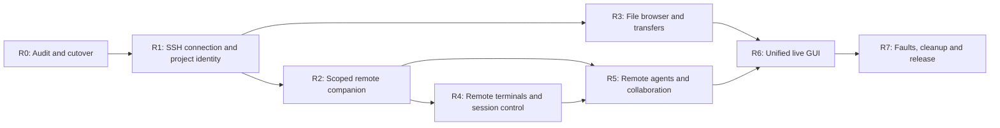

# Warpai SSH Remote and File Management Plan

Date: 2026-10-03. Status: revised product plan; SSH Remote is not implemented or accepted. This revision supersedes the former M6 machine-to-machine collaboration direction. R0 implementation has begun; see IMPLEMENTATION.md for the source checkpoint and pending gates. No item below becomes complete merely because an earlier gateway test passed.

## 1. Outcome and reading order

Build a local Warpai GUI that manages SSH remote project environments: browse/edit/transfer remote files, open remote terminals, launch remote CLI agents, show their state and tasks, and control their sessions. Agent commands, file operations, tests and Git operations execute on the selected remote machine. Agents in the same selected remote project communicate through the existing collaboration semantics. The remote machine does not need a full Warpai GUI.

Read [PRODUCT.md](PRODUCT.md) for behavior SR01–SR41, [TECH.md](TECH.md) for architecture and validation, [API.md](API.md) for contracts, [CUTOVER.md](CUTOVER.md) for actual source dispositions, and [ACCEPTANCE.md](ACCEPTANCE.md) for evidence. [PROGRESS.md](PROGRESS.md) retains chronology. The previous M0–M7 documents are preserved under [legacy-machine-collaboration](legacy-machine-collaboration/README.md); their IDs describe historical evidence only.

### GUI ownership and default experience

The existing left Tab/Pane sidebar is the sole Agent/session management surface. Extend its native rows and context actions; do not add a parallel Agent dashboard, roster tab or independently managed session list. The terminal remains the interaction/approval surface. The existing collaboration panel becomes an on-demand project task/message/history view, closed by default on fresh profiles; preserve an existing user's saved panel selection. Background task events never open it or steal focus.

| Surface | Owns | Does not own |
| --- | --- | --- |
| Existing Tab/Pane sidebar | Session navigation, CLI/run status, remote host/project identity, concise attention/task badges, rename/focus/reconnect/stop/detach actions | Full task dependencies, review/evidence history or another task state machine |
| Terminal/editor | Agent dialogue, commands, native approvals and protected drafts | Task completion inferred from arbitrary output |
| On-demand collaboration panel | Task/message relationships, selected task detail, evidence and durable history; links to owning sessions | A duplicate Agent roster, session navigation/control dashboard or mandatory manual workflow |
| Connections/Projects and Transfers | SSH/SFTP setup, root selection, deployment and explicit file operations | A second Agent manager |

A tab may contain multiple panes and an Agent run may survive a detached view. Preserve existing Tab/Pane granularity: status attaches to its actual pane/run, with only concise aggregation at the tab. Retained detached sessions are reachable in the same project sidebar hierarchy, not a separate manager. Task-to-session links resolve exact project/actor/run; tab-to-task links open the task view only on explicit user action. Sidebar badges and task details use the same authoritative task/runtime projections.

Keep dependency/review/history/replay safeguards in the backend. Show a compact active-task list/detail by default when the user opens the task view; reveal attempts, dependencies, archive/export/purge and risk overrides on demand. Two Agents exchanging messages must not require creating a board or manually stepping through every task stage.

## 2. Confirmed scope decisions

| Area | Current planning decision | Consequence |
| --- | --- | --- |
| Local application | macOS and Windows GUI | Preserve default Lite and warp_platform builds and terminal guardrails |
| SSH project | One authenticated SSH account, one explicitly selected canonical remote root | Same host does not automatically expose every project or account |
| Files over SSH | SFTP is the default transfer protocol; remote helper may provide scoped listing/edit metadata | SFTP is distinct from FTP/FTPS |
| FTP/FTPS | Explicitly excluded by the user | The requested file transfer is SFTP over SSH; no additional FTP profiles, passwords, TLS/data-channel machinery or insecure fallback |
| Agent execution | Remote installed vendor CLI, remote runtime and remote provider authentication | Do not copy local API keys, home directories or CLI configurations |
| Task authority | Remote project collaboration service, reusing warp-agent-bus; local GUI reads projections | Agents in that project need no second native app; no duplicate authoritative local task database |
| Remote component | Small repository-owned companion/service launched for a managed SSH project | No cloud account, public listener, system service or privileged installer |
| Remote platforms | Linux, macOS and Windows, confirmed by the user | Linux is a remote service/project target only; local desktop builds remain macOS/Windows |
| Session continuity | Explicit lifecycle policy and capability report | No claim that closing local SSH stops the remote process; reattachment requires proven remote ownership |
| Cross-host collaboration | Removed from this delivery | No enrolled devices, invitation flow, writable coordinator federation or cross-host task routing |
| Arbitrary manual SSH tabs | Continue working as ordinary terminals | They do not silently become managed remote projects or gain MCP/task access |

The user confirmed SFTP-only file transfer and Linux/macOS/Windows remote support on 2026-10-03. These supersede the earlier provisional FTP and remote-platform questions. Align AGENTS.md, packages, artifact targets and acceptance matrix with these decisions.

## 3. Current implementation: what exists and what is missing

- Retain the implemented local task engine, SQLite migration/backup/ledger, dependencies, claims, cancellation/retry fencing, messages/threads, evidence, reservations and bounded history.
- Retain native collaboration panel and task controls. Both-platform historical native capture gates include 115 states, clipboard export, participant metadata and draft/focus checks; these are local gates, not SSH Remote gates.
- Existing upstream SSH detection, remote-server client/transport, remote file tree and SFTP upload are reuse candidates. The installer still refers to upstream Oz/download infrastructure, platform detection assumes uname, and the client contract does not prove an independently packaged compatible server exists. Audit these before reuse.
- Existing new remote modules implement enrolled-device/coordinator exchange. They do not start agents in remote project environments, provide a file-transfer manager or supply the desired SSH GUI.
- New enrollment/profile/credential helpers are partly implemented, but their product flow is superseded. Preserve shared secure-storage fixes; do not finish the obsolete Devices/grants UI.
- SSH Remote connections GUI, remote project identity, scoped companion deployment, remote PTY management, transfer queue, remote-agent discovery/MCP binding, remote task projection and complete fault handling are new engineering work. Session UI reuses the existing sidebar; a second Agent/session dashboard is explicitly excluded.

## 4. Execution order and release gates

Use Specify → Plan → Task → Execute → Verify. This document supplies the revised task sequence; code changes begin only after the relevant contracts and static UI states are concrete. The plan does not authorize parallel agents automatically.

File browsing and terminal foundations may be developed independently after identity/security contracts stabilize; live integrated UI still follows static screenshot acceptance. File-transfer work cannot substitute for SSH project/agent work. A usable file-manager preview is not completion of the full product.

### R0 — Source audit, scope correction and safe removal

- [ ] **R0.1** Freeze old product additions; inspect all remote entrypoints/callers using CodeGraph, record source SHA and actual reachable behavior. Follow CUTOVER D01–D16.
- [ ] **R0.2** Prove what upstream remote-server/file-tree/SSH paths do in Lite and on both local OSes. Locate the server implementation/artifact source; do not assume a client crate is a distributable server.
- [x] **R0.3** Define the typed remote environment/project/connection identities and ownership before extending storage. Document all remote-vs-local path call sites and proposed migrations. Contract/schema/inventory accepted; see PROGRESS. Live GUI environment integration remains R1/R6.
- [x] **R0.4** Disable/remove app enrollment worker, invitation/device UI plans and obsolete gateway entrypoints only after a schema/compatibility fixture is in place. Preserve local task/operator APIs and shared secure-storage hardening.
- [ ] **R0.5** Fence legacy credentials and profiles; expose old metadata only for export/removal. Do not automatically turn a device profile into a trusted SSH project.
- [x] **R0.6** Inventory legacy device tables, actors, cursors and unresolved intents; retain unknown work/history and original backups. Implement read-only legacy interpretation before deleting active writes. Storage source `d71d8b1`, run `37041826672`, remains byte-identical; see PROGRESS.
- [ ] **R0.7** Replace obsolete tests with same-invariant tests for the new service, while retaining migration fixtures. Verify no cloud installer/login/billing dependency becomes reachable.
- **Exit:** V01, V02 and V18. Removal has a concrete dependency map and restores neither old authorization nor old mutations. Source removal is future work; writing this plan does not delete code.

### R1 — Connections GUI, SSH authentication and remote project identity

- [ ] **R1.1** Static native Connections/Projects UI: empty, authenticating, host verification, ready, failed, reconnecting and disabled states; narrow/wide, themes and text scaling.
- [ ] **R1.2** SSH profiles: display name, alias or host/user/port, jump-host configuration reference, optional identity-file reference, default remote root; store metadata only. Reuse system OpenSSH configuration without displaying private key contents.
- [ ] **R1.3** Separate interactive authentication/host-key review from clean machine protocol pipes. Unknown host offers fingerprint review; changed host is blocked. Never auto-answer trust/password prompts or disable verification.
- [ ] **R1.4** Validate system ssh/sftp presence, safe arguments, timeouts and cancellation. Keep interactive terminal, file transfer and control status independent. An established terminal does not prove SFTP/helper availability.
- [ ] **R1.5** Resolve account/server identity and canonical remote project root remotely; names/aliases/identical path text do not establish equality. Record root display spelling separately from canonical identity.
- [ ] **R1.6** Open remote projects explicitly; show remote banner on tabs/explorer/agent/task actions. Restore layouts without auto-running old commands or reviving agent capabilities.
- [ ] **R1.7** Select a project; discover available capabilities and remote OS/shell. Reject unsupported targets with specific guidance. Include approved Linux helper targets without adding a Linux desktop UI.
- **Exit:** V03/V04/V05. No execution/file request silently falls back to the local machine.

### R2 — Repository-owned remote companion and durable project service

- [ ] **R2.1** Audit and reuse remote_server protocol/client/manager where they meet the new boundary. Preserve one framing implementation per selected control protocol; do not combine JSON and protobuf implicitly.
- [ ] **R2.2** Build a small compatible remote companion from this repository. Include versions, capabilities, remote root identity, PTY/session controls and collaboration dispatch; no model runtime or native GUI requirement.
- [ ] **R2.3** Package provenance and checksum manifest in GitHub artifacts. Replace upstream Oz/cloud download dependency with the reviewed repository artifact. Offer explicit deployment destination and version; support manual path selection.
- [ ] **R2.4** Upload/install only owned companion files in a user-private directory, validate platform/hash, activate atomically, preserve previous compatible version. No sudo, global PATH edit, shell startup edits or SSH-server/firewall changes.
- [x] **R2.5** Start a scoped per-account/per-project service through SSH. Define single-instance lock and attach ownership; duplicate local connections reuse the same project authority or fail visibly rather than create two writers.
- [ ] **R2.6** Private remote IPC for same-account agent MCP; fresh per-launch credentials scoped to exact project/run. The SSH account is the remote trust boundary; distinguish GUI operator access from agent capabilities.
- [ ] **R2.7** Keep authoritative task data on the remote project service and local data private. Persist snapshots/cursors/pending GUI mutations locally as projections/intents only.
- [ ] **R2.8** Define shutdown, bounded session retention and reconnect behavior. Service loss fences new work; retained attempts remain unknown until exact owners reconcile.
- **Exit:** V06/V07/V08/V17. An ordinary remote machine with no full Warpai GUI can host the project; no unreviewed upstream download is required.

### R3 — Remote file browser, safe edit and transfer manager

- [ ] **R3.1** Static Explorer/Files/Transfers states: loading, empty, permission denied, stale, symlink, large directory, conflict, progress, paused, cancelled and partial failure.
- [ ] **R3.2** SFTP listing/stat/read/create-directory/rename/delete/upload/download within selected root; preserve Unicode/spaces, directory navigation, sorting and explicit refresh. Do not parse human-readable ls output as the API.
- [ ] **R3.3** Resolve remote path containment on the server. Symlink traversal, Windows drives/UNC/case and Unix path semantics belong to the remote filesystem; reject escapes and invalid names without local PathBuf canonicalization.
- [ ] **R3.4** Open bounded text remotely in existing editor/viewer; show provenance/encoding/read-only/binary/large-file states. Save against original remote fingerprint/version, detect concurrent Agent/editor changes, and present reload/compare/explicit overwrite.
- [ ] **R3.5** Queue file/directory uploads and downloads with progress, cancel/retry and bounded concurrency. Review transfer endpoints and overwrite targets; transfer only explicitly selected content.
- [ ] **R3.6** Temporary sibling files plus atomic rename where available; unknown commit/unsupported atomic save visible. Resume only after source/destination identity verification; unsupported resume restarts a fresh owned partial file, never appends blindly.
- [ ] **R3.7** File-only SFTP connections work even when the project helper/Agent integration is unavailable. Share the verified SSH identity, expose SFTP capability failures and never offer an FTP fallback. Support binary transfer and folder batches without requiring Agent participation.
- [ ] **R3.8** Transfer history stores bounded metadata, not credentials/file contents; failed/cancelled transfers never count as complete. Lost delete/rename responses reconcile destination/source state before retry.
- [ ] **R3.9** Show overlapping active Agent reservations before GUI save/upload/delete; warn that advisory reservations are not filesystem locks. Never imply external writers are prevented.
- **Exit:** V09–V12. Actual bytes verified on controlled endpoints; connection type/capabilities remain truthful. No FTP/FTPS implementation or tests are part of this package.

### R4 — Remote terminal and session lifecycle

- [ ] **R4.1** Reuse terminal block renderer/input/PTY abstractions and audited upstream SSH lifecycle. Open shell in the exact remote root, with remote shell/environment and visible host/project identity.
- [ ] **R4.2** Support multiple remote terminals, tabs/splits, resize, paste, IME, Unicode, Ctrl-C and interactive programs. Local cwd/environment must not masquerade as remote context.
- [x] **R4.3** Separate session ID, process run ID, SSH connection epoch and terminal attachment. Remote helper verifies ownership for input/resize/interrupt/close. Source `3a37ed2`, run `37105738779`; GUI lifecycle remains R4.1/R4.2/R4.4/R4.5.
- [ ] **R4.4** Implement close tab/detach and disconnect as retaining managed remote sessions; Stop requests exit for the exact run. Project/profile removal reviews active sessions with explicit Stop or Leave running. Prompt only when an action will abandon/stop active work; report stop requested versus observed exit.
- [ ] **R4.5** On network loss protect local draft and stop delayed submission. Reattach only to the same verifiably surviving remote process if the service supports it; otherwise show ended/unknown and require explicit new launch.
- [ ] **R4.6** Bounded terminal buffers/backpressure; interactive output cannot starve heartbeats/tasks/transfers. Do not retain raw terminal transcripts in task diagnostics.
- **Exit:** V13/V14/V15. Real remote process location and lifecycle are proven, including failed/replaced attachments.

### R5 — Remote Agent launch, MCP and project-local communication

- [ ] **R5.1** Discover installed eligible CLI versions remotely, separately from local discovery. Show missing CLI/provider authentication/permissions; do not install vendors or copy local authentication automatically.
- [ ] **R5.2** GUI launch and terminal-recognized managed launches bind the remote native process to the selected project and remote MCP endpoint. Preserve vendor adapters and separate Qoder/QoderCN identities.
- [ ] **R5.3** Two remotely running agents register distinct actor/run identities and exchange messages/tasks through the reused Store/MCP operations. Same project groups across managed SSH tabs; other roots/users/hosts remain isolated.
- [ ] **R5.4** Expose supported native lifecycle states with source/age; connected, idle, task-ready, permission-blocked, draft-protected and unknown remain distinct. Unsupported remote adapters cannot advertise automatic wake.
- [ ] **R5.5** Adapt guarded delivery to remote terminal ownership: local draft/focus guard plus verified remote run/readiness/approval/input guard; recheck before prompt and delayed Enter. Persist claimed/submitted separately from acknowledgement/start.
- [ ] **R5.6** Keep dependencies, claim FIFO, attempt/version fencing, rework/review, deadlines and cancellation in the existing task engine. Cancellation targets only the owned remote process; unknown execution blocks silent reassignment.
- [ ] **R5.7** Remote path reservations/evidence validate on the producing remote project. File references open explicitly over that project's authenticated file path; never substitute local same-named files.
- [ ] **R5.8** Run deterministic assign→remote edit→remote test→submit→rework→accept through the actual GUI. Record remote process/root and file evidence, not just bridge registration.
- **Exit:** V16/V17/V19/V20. Vendor/model versions without runtime resources remain unverified; deterministic fixtures cannot claim vendor compliance.

### R6 — Unified GUI and task management

- [ ] **R6.1** Static UI acceptance precedes live data: Connections/Projects, Explorer, Transfers, existing Tab/Pane sidebar status/actions and on-demand collaboration task/message detail using existing themes/components. No duplicate Agent/Session dashboard.
- [ ] **R6.2** Bind remote tree, sidebar Agent/session rows, terminals, on-demand tasks/messages/history, remote host status (SR41/HOST-STATUS.md) and transfers to exact environment/project. Independent tabs retain their own scope; all session status and task badges share the authoritative projections.
- [ ] **R6.3** Reuse the collaboration panel for a compact active-task list/detail and messages, closed by default on fresh profiles. Keep assign/cancel/review where relevant; reveal retry/reassign/attempts/dependencies/archive/search/export/purge on demand. Preserve saved selection, show stale cache and disable unsafe writes offline; never require manual GUI steps for Agent-to-Agent communication.
- [ ] **R6.4** Extend existing Tab/Pane rows and context actions for focus/rename/status/reconnect/stop/detach. Represent retained detached sessions in the same project hierarchy without duplicate entries. Add explicit task→exact owning session and sidebar→current task links; missing/replaced runs remain unavailable, never focus another same-named agent.
- [ ] **R6.5** Reconnect diagnostics show SSH/authentication/helper/SFTP/MCP readiness separately with actionable remediation. Connection removal preserves task history and does not assert unreachable processes stopped.
- [ ] **R6.6** Scope/generation-fence all async callbacks. Project switching/connection removal must discard stale file/task/Agent UI results without stealing focus or losing drafts.
- [ ] **R6.7** Native screenshot/keyboard/accessibility review at narrow/wide widths, themes and 125% text. Include long host/path names, multiple Agent panes in one tab, mixed local/remote panes, retained detached runs, concurrent transfer/task activity, task/session cross-links and preserved drafts with the task panel closed.
- **Exit:** V21/V22. No sample data is presented as live, and refresh/late responses never redirect an action to a different environment.

### R7 — Faults, migration, removal and final delivery

- [ ] **R7.1** Controlled SSH/SFTP fixtures and dropped-response injection: auth rejection, changed host, SFTP negotiation error, packet loss, helper crash, service restart, local sleep, partial transfer and disk full.
- [ ] **R7.2** Original mutation receipts and connection fences: lost task/launch/file response, duplicate frames, replacement, stale callback, expired run and interruption. Never blindly repeat arbitrary commands.
- [ ] **R7.3** Backup/restore and schema-v6 legacy cutover: unresolved old intents, unknown attempts, revoked grants, orphan profiles and secure-key removal failure. Preserve all task/evidence history.
- [ ] **R7.4** Complete CUTOVER deletion items and prove no old enroll/auth/grant/device endpoint remains active. Remove obsolete worker APIs/test expectations only after new boundaries and migrations are covered.
- [ ] **R7.5** GitHub-only Rust protocol/app/default/platform checks, native captures and packages from exact final committed source. Include companion artifacts for every approved remote target; desktop cross-build alone does not prove them.
- [ ] **R7.6** Eight-hour controlled SSH/session/task/transfer/reconnect soak. Preserve drafts, queues and bounded memory; distinguish old backend-only soak from new end-to-end evidence.
- [ ] **R7.7** Real supported vendor-role matrix and physical-device matrix when resources exist. No paid turns without budget; unavailable combinations stay unverified and are excluded from release claims.
- [ ] **R7.8** Document prerequisites, supported protocols/OS/CLI versions, companion install/remove, data locations, export/backup/restore and session close semantics. Update README/MEMORY and v1 coverage wording.
- [ ] **R7.9** Push complete tracked source and build through existing standalone GitHub workflows after final gates pass. Do not include .codegraph, secrets, generated captures or daily-profile files.
- **Exit:** V01–V24 pass for claimed capabilities. Report engineering completion separately from unavailable physical/vendor acceptance.

## 5. Legacy work mapping

| Old package | New disposition |
| --- | --- |
| M0 native real-execution baseline | Reuse owned harness and versions; add remote process/file-location proof under R5/R7 |
| M1 durable contracts/storage | Keep foundation and migrations; add environment identity without schema downgrade |
| M2 native collaboration panel | Keep task/message/history views on demand; remove duplicate Agent navigation/session controls after sidebar migration in R6/CUTOVER D14 |
| M3 task controls/dependencies | Keep shared domain logic; validate remote run/process outcomes in R5 |
| M4 local spaces/reservations | Keep existing local behavior/data; remote project is isolated by default, cross-project grouping deferred |
| M5 history/threads/evidence | Keep; extend producing-location semantics and explicit remote fetch |
| M6 enrolled-device coordination | Superseded; remove invitation/grant/dual-app flows, reuse only audited primitives |
| M7 release acceptance | Keep build/provenance discipline; replace remote gates with V01–V24 |

## 6. Completion definition and implementation constraints

Every task requires a code change or documented reuse, one minimal runnable feature check, failure/boundary checks where meaningful, and exact-source evidence in ACCEPTANCE. Unchecked work remains pending. Static and backend tests do not establish real SSH, remote filesystem correctness or model task execution.

Use existing terminal/file-view components, system OpenSSH and installed dependencies first. If upstream client/server or SFTP primitives cannot meet verified contracts, record the missing capability before introducing a dependency; do not recreate a generic transport/plugin platform. No broad core-terminal refactor, automatic repository sync, git reset/merge, cloud account, telemetry, public server or provider SDK runtime.

Retain unknown execution and retry request identity. Bound IO/queues/search/history. Never store secret values in source, logs, preferences, docs or memory. Compile/test Rust on GitHub only. Validate documentation/scripts/workflows locally where appropriate. Preserve unrelated worktree changes.

## 7. Planning risks and unresolved constraints

- Linux remote service support is authorized; packaging, libc/architecture baselines and SSH/SFTP availability still need explicit compatibility records. Desktop macOS/Windows support is unchanged.
- SFTP alone is authorized. Do not introduce FTP/FTPS dependencies, settings or insecure transfer fallback.
- Existing upstream remote_server setup downloads Oz and currently lacks Windows remote platform detection. A working inherited terminal path is not proof that the needed companion is available independently.
- Managed session detach/reattachment requires owned remote PTY/process retention and bounded replay; prove it on each remote target rather than infer it from SSH reconnect or assume tmux exists.
- Safe remote wake needs native remote adapter evidence. Rendered TUI text alone cannot clear approval/draft guards.
- File write/rename atomicity and resume vary by server. Negotiate and show capability limits; do not silently claim transactional file operations across SFTP servers.
- No physical Windows SSH host or model-call budget was supplied. Continue implementation/controlled CI while preserving explicit unverified release rows.

No calendar estimate is carried forward from the old 37–57-day machine-collaboration plan. Re-estimate after R0/R1 prove reuse feasibility and protocol/platform scope; old estimates measure a different product.
